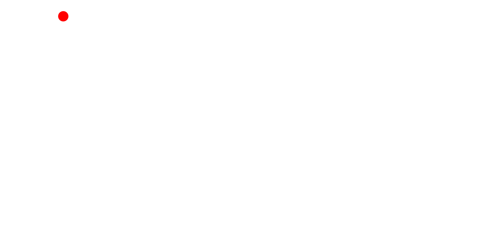

<p align="center">
  
</p>

# Project Raven — Architecture

## Overview

Project Raven is an autonomous defense system that transforms reactive security into proactive threat hunting. It combines a runtime-switchable multi-provider AI layer, ML anomaly + zero-day detection, Incalmo-style declarative kill-chain planning, and a closed continual-learning loop that lets the agent *get better with use*.

Five Hermes Agent-inspired safety primitives wrap the whole stack: JWT/RBAC auth, audit logging, an approval gate with a hardline `UNRECOVERABLE_BLOCKLIST`, an inbound jailbreak detector, and a gated offensive red-team capability. Production safety guards refuse insecure defaults at startup.

---

## Core Components

### 1. Multi-Provider AI Layer

Provider-agnostic abstraction that hot-swaps LLM backends at runtime. Inspired by [Hermes Agent](https://github.com/NousResearch/hermes-agent) (`provider:model` shorthand) and [Claude Code](https://github.com/anthropics/claude-code) (`/model` switching).

```
raven/ai/
├── base.py                 BaseAIClient ABC + SUPPORTED_PROVIDERS catalogue
├── factory.py              create_client_from_config() — router
├── registry.py             ProviderRegistry singleton — thread-safe hot-swap + named profiles
├── model_orchestrator.py   FAST / REASON / VISION role routing
├── lmstudio_client.py      Backward-compat shim
└── providers/
    ├── lmstudio.py           LM Studio native v1 API + OpenAI-compat fallback
    ├── openai_compat.py      OpenAI / OpenRouter / Ollama / Nous / OpenCode
    ├── anthropic_provider.py Anthropic native SDK (graceful degradation)
    └── tinker_provider.py    Raven-trained LoRA fine-tunes via Tinker
```

**Supported providers:**

| Provider | Transport | Key | Notes |
|---|---|---|---|
| `lmstudio` | LM Studio native v1 | — | Local default |
| `openai` | OpenAI-compat | ✅ | |
| `openrouter` | OpenAI-compat | ✅ | 300+ models |
| `anthropic` | Anthropic SDK | ✅ | |
| `ollama` | OpenAI-compat | — | Local |
| `nous` | OpenAI-compat | ✅ | Hermes models |
| `opencode` | OpenAI-compat | ✅ | |
| `tinker` | Tinker SDK / OpenAI-compat | ✅ | Raven-trained fine-tunes |

**Runtime switching** — CLI `raven provider set …` or `POST /ai/provider` (admin). `base_url` validated against `AI_ALLOWED_BASE_URLS` allowlist to close credential-exfil class.

### 2. Authentication & RBAC

```
raven/auth/
├── models.py         User, Role (viewer | operator | admin), TokenPair
├── password.py       Argon2id hashing (OWASP 2023 params: t=2, m=19_456, p=1)
├── jwt_manager.py    HS256/RS256 + access (15m) + refresh (7d) + revocation set
├── user_store.py     Thread-safe in-memory store (Phase 3 → SQLAlchemy)
├── dependencies.py   FastAPI Depends(current_user) + require_role()
└── routes.py         /auth/login /auth/refresh /auth/logout /auth/me
```

**Role hierarchy:** `admin > operator > viewer`. Every mutating route declares `Depends(require_admin)` or `Depends(require_operator)`. Refresh-token rotation on every `/auth/refresh` + revocation set guard against theft.

### 3. Approval Gate (Hermes-style)

```
raven/approval/
├── models.py         ApprovalMode (manual/smart/off), ApprovalVerdict
├── patterns.py       DANGEROUS_PATTERNS + UNRECOVERABLE_BLOCKLIST
├── store.py          PendingApprovalStore + AllowlistStore
├── smart.py          SmartApprover — LLM-assisted risk triage
├── gate.py           ApprovalGate singleton — decision orchestrator
└── dependencies.py   approval_required() factory for FastAPI routes
```

**Evaluation order for every dangerous command:**
1. `UNRECOVERABLE_BLOCKLIST` — `rm -rf /`, fork bomb, `mkfs /dev/sd*`, `dd of=/dev/sd*`, `curl|sh`. **No override possible.** Not even YOLO + admin.
2. Permanent allowlist — operator-approved regex patterns.
3. Dangerous-pattern match — branches on `ApprovalMode`:
   - `manual` → enqueue `PendingApproval`, return 202 with `request_id` for operator polling
   - `smart` → `ModelOrchestrator(FAST)` triages → auto-approve / auto-deny / escalate to manual
   - `off` (YOLO) → auto-approve. **Refused in prod by the safety validator.**

### 4. Red-Team Subsystem

```
raven/redteam/
├── normalizer.py             ParseltongueNormaliser (33 obfuscation decoders)
├── jailbreak_patterns.py     Fingerprint library (8 L1B3RT4S families)
├── detector.py               JailbreakDetector — weighted score 0..1
├── middleware.py             Buffers inbound /ai/* /hunt/* bodies → scans → blocks
├── hardness_test.py          ProviderHardnessTest — 10 canaries → 0–10 score
└── offensive.py              OffensiveGodmode (triple-gated, default off)
```

**Defensive pipeline (always on):**
1. Inbound prompt → `ParseltongueNormaliser` decodes zero-width / leetspeak / Unicode homoglyphs / Base64 / hex / Braille / Morse / Pig Latin / math alphabets / brackets / acrostic.
2. Decoded text → fingerprint scan against L1B3RT4S patterns (boundary_inversion, refusal_inversion, og_godmode, unfiltered_liberated, dan, injection, role_play, content).
3. Score ≥ `JAILBREAK_BLOCK_THRESHOLD` → 403 + `X-Raven-Jailbreak-Score` header on response.

**Hardness test (admin):** `POST /redteam/hardness` runs 10 canary jailbreaks against the active provider → resistance score with weakest-family breakdown.

**Offensive Godmode (triple-gated, default off):** requires (a) `OFFENSIVE_REDTEAM_ENABLED=true`, (b) admin role, (c) `X-Raven-Authorization-Token` matching `OFFENSIVE_REDTEAM_SESSION_TOKEN` via `hmac.compare_digest`, (d) `sandbox_session_id` in body. Strategies are synthesised at runtime — L1B3RT4S templates are NOT redistributed.

### 5. Continual Learning (Tinker)

```
raven/training/
├── client.py                 TinkerClient (lazy SDK) + MockTinkerClient (offline)
├── models.py                 Dataset, TrainingJob, ModelVersion, ABTestRun
├── datasets/
│   ├── base.py                 JsonlWriter + pii_scrub
│   ├── from_audit_log.py       Mutation history → SFT pairs
│   ├── from_cybergym.py        CyberGym verdicts → RL trajectories
│   ├── from_killchain.py       Approved tasks → tool-use SFT
│   ├── from_redteam.py         Jailbreaks → DPO (chosen, rejected)
│   └── distillation.py         Teacher → student corpus
├── jobs/                       DistillJob · SFTJob · CodeRLJob
├── registry.py                 ModelRegistry — versions/jobs/abtests/datasets
├── secrets.py                  FernetVault — encrypted-at-rest TINKER_API_KEY
├── eval.py                     Hardness + canary + CyberGym smoke
└── abtest.py                   Bernoulli router with auto-promote/rollback
```

**Loop:** audit log + CyberGym verdicts + kill-chain approvals → JSONL → Tinker LoRA fine-tune → `ModelVersion` row → eval → A/B test (5% traffic, 95% win threshold) → auto-promote / auto-rollback.

**Mock-friendly:** `MockTinkerClient` replays a 3-tick state machine when `TINKER_API_KEY` is absent — entire pipeline runs offline for CI and hackathon demos.

### 6. Threat Detection Engine (ML/AI Core)
- **Anomaly Detection**: Isolation Forest + Autoencoders. `load_model()` gated by `ALLOW_PICKLE_MODELS` + `MODEL_PATH` jail.
- **Signature-Based Detection**: Known pattern matching.
- **Zero-Day Prediction**: Ensemble (IsolationForest + RandomForest). `load_models()` gated the same way.
- **Behavioral Profiling**: Baseline + deviation flagging.

### 7. Tool Orchestration Layer
- **SSH Manager**: `paramiko.RejectPolicy()` + operator-supplied `known_hosts`. No `AutoAddPolicy`.
- **Bash Executor**: `shell=False` by default with `shlex.split`. Opt-in `allow_shell=True` for legacy callers.
- **Metasploit / NMAP / Nuclei / Empire / Ghidra / Shodan**: integration adapters with structured result types.
- **Remediation engine**: patch IDs regex-validated + `shlex.quote`-wrapped.
- **Containment actions**: pid coerced to positive `int` — no string interpolation into `kill -9`.

### 8. Proactive Threat Hunting Module

Implements the three techniques described in Anthropic's Claude Opus 4.6 zero-day research:
- **Variant analysis** — `raven/ml/variant_analyzer.py` mines git history for security commits, finds sibling code lacking the fix
- **Precondition reasoning** — extracts control-flow constraints around dangerous patterns
- **Algorithm-semantic mining** — surfaces implicit invariants in compression / parser / crypto code

Plus Incalmo-style declarative kill-chain planning (`raven/hunters/kill_chain_planner.py`) with MITRE ATT&CK alignment and HITL approval on destructive stages (exploitation, lateral movement, exfiltration, privilege escalation, post-exploitation).

### 9. Mitigation Response
- Containment (process kill via SSH, IP block)
- Remediation (apt-get patch, configuration hardening)
- Response orchestrator chains containment + remediation per threat type

### 10. Observability

```
raven/observability/
├── logging.py     structlog JSON in prod, console in dev. Request ID propagated.
├── metrics.py     Prometheus exposition + MetricsMiddleware
└── tracing.py     OpenTelemetry auto-instrumentation when OTEL_ENDPOINT set
```

**25+ metrics** including request latency, AI tokens prompt/completion, provider switches, kill-chain stages, approval verdicts, blocklist hits, jailbreak detections, provider hardness, training jobs, A/B win rates.

### 11. Production Safety

`raven/config/__init__.py` runs a `_enforce_secret_key_floor` validator on every start and `_enforce_prod_safety` when `RAVEN_ENVIRONMENT=prod`. Refuses to boot when:

| Condition | All envs | Prod only |
|---|---|---|
| `SECRET_KEY` is the dev default | ✅ unless `ALLOW_INSECURE_DEFAULTS=true` | also refuses the opt-in itself |
| `DEBUG=true` | — | ✅ |
| `CORS_ORIGINS` contains `*` or is unset | — | ✅ |
| `APPROVAL_MODE=off` (YOLO) | — | ✅ |
| `OFFENSIVE_REDTEAM_ENABLED=true` without session token | ✅ | ✅ |
| `CONTINUAL_LEARNING_ENABLED=true` without `TINKER_API_KEY` | ✅ | ✅ |

---

## End-to-end request flow

```
                  ┌────────────────────────────────────┐
   HTTP request ─►│  CORSMiddleware                    │
                  └────────────────┬───────────────────┘
                                   ▼
                  ┌────────────────────────────────────┐
                  │  JailbreakDetectionMiddleware       │
                  │  Parseltongue.normalise → score     │
                  │  403 if ≥ threshold                 │
                  └────────────────┬───────────────────┘
                                   ▼
                  ┌────────────────────────────────────┐
                  │  AuditLogMiddleware                 │
                  │  X-Request-ID propagation +         │
                  │  per-mutation audit entry           │
                  └────────────────┬───────────────────┘
                                   ▼
                  ┌────────────────────────────────────┐
                  │  MetricsMiddleware                  │
                  │  Prometheus latency + count         │
                  └────────────────┬───────────────────┘
                                   ▼
                  ┌────────────────────────────────────┐
                  │  Route handler                      │
                  │  Depends(current_user) →            │
                  │  Depends(require_admin/operator)    │
                  └────────────────┬───────────────────┘
                                   ▼
                  ┌────────────────────────────────────┐
                  │  ApprovalGate.check() if dangerous  │
                  │  UNRECOVERABLE_BLOCKLIST →          │
                  │  Allowlist → mode-specific          │
                  └────────────────┬───────────────────┘
                                   ▼
       ┌───────────────────────────┼───────────────────────────┐
       │ Domain layer              │                            │
       │  ┌─────────────┐  ┌──────────────┐  ┌──────────────┐  │
       │  │ Hunting     │  │ ML/AI engine │  │ Tools         │  │
       │  │ Hypothesis  │  │ Anomaly      │  │ SSH (Reject)  │  │
       │  │ Kill-chain  │  │ Zero-day     │  │ Bash (no sh)  │  │
       │  └──────┬──────┘  └──────┬───────┘  │ Nmap/Nuclei   │  │
       │         │                │           └───────────────┘  │
       │         └────────┬───────┘                              │
       │                  ▼                                       │
       │   ┌──────────────────────────────────────────────────┐  │
       │   │ Multi-Provider AI Layer                          │  │
       │   │  ProviderRegistry singleton (hot-swap)            │  │
       │   │  lmstudio · openai · anthropic · openrouter ·     │  │
       │   │  ollama · nous · opencode · TINKER                │  │
       │   │  System prompt injected by _build_messages        │  │
       │   └──────────────────────────────────────────────────┘  │
       └────────────────────────────┬─────────────────────────────┘
                                    ▼
                  ┌────────────────────────────────────┐
                  │  Mitigation                         │
                  │  Containment + Remediation          │
                  └────────────────┬───────────────────┘
                                   ▼
                  ┌────────────────────────────────────┐
                  │  Telemetry                          │
                  │  audit · prom · structlog · OTel    │
                  │  + (if approved) Tinker training-    │
                  │  data candidate                     │
                  └────────────────────────────────────┘
```

---

## Technology Stack

### Core
- **Language:** Python 3.11+
- **API:** FastAPI + Pydantic v2
- **CLI:** Typer (`raven {provider, model, prompt, approval, redteam, train}`)
- **Pkg:** uv-friendly, pinned `requirements.txt`

### AI / LLM
- **Local:** LM Studio (native v1), Ollama (OpenAI-compat)
- **Cloud:** OpenAI, Anthropic, OpenRouter, Nous, OpenCode
- **Trained:** Tinker (Llama-3.1, Qwen-2.5) — Raven's own fine-tunes
- **Abstraction:** `BaseAIClient` ABC with shared task helpers
- **Hot-swap:** `ProviderRegistry` singleton — REST or CLI, no restart

### Security primitives
- **Auth:** PyJWT (HS256/RS256), Argon2id (`argon2-cffi`)
- **Rate-limit:** `slowapi`
- **Crypto-at-rest:** Fernet (`cryptography`) for `TINKER_API_KEY`

### ML
- **Frameworks:** PyTorch, scikit-learn, TensorFlow, numpy, pandas, scipy
- **Models:** Isolation Forest, RandomForest, Autoencoders, LSTM, Transformers
- **Graph:** NetworkX for attack-graph mapping

### Security tools
- Nmap (`python-nmap`), Metasploit (`pymetasploit3`), Nuclei (subprocess), Empire C2 (HTTP), Ghidra (`pyghidra` / headless), Shodan (`shodan` SDK), YARA, Suricata, Scapy

### Observability
- **Logs:** `structlog` (JSON in prod, console in dev)
- **Metrics:** `prometheus_client` — `/metrics` exposition
- **Tracing:** OpenTelemetry — FastAPI + requests auto-instrumentation

### Data plane
- **Persistence:** PostgreSQL + TimescaleDB (Phase 3, planned), in-memory thread-safe stores today
- **Cache / queue:** Redis (jwt revocation), Celery
- **Streaming:** Kafka (planned)

### Infrastructure
- **Containers:** Docker multi-stage, distroless-ish runtime, non-root (uid 10001)
- **Orchestration:** Kubernetes via bundled Helm chart at `deployment/helm/raven/`
- **Security context:** runAsNonRoot, readOnlyRootFilesystem, drop ALL caps, seccomp `RuntimeDefault`
- **Networking:** Ingress + cert-manager + NetworkPolicy (deny-all + allowlisted egress)
- **HA:** HPA 3–12 replicas, PodDisruptionBudget `minAvailable: 2`, topologySpreadConstraints across zones

### CI/CD
- **GitHub Actions:** lint (ruff) + type-check (mypy) + bandit + Trivy + pytest (3.11/3.12) + helm lint + kubeval
- **Release:** multi-arch image (amd64+arm64) + cosign keyless signing + Helm chart OCI push
- **Pre-commit:** ruff, bandit, gitleaks

---

## Tests

**224 passed, 24 skipped** as of `f767416`:

```
tests/test_ai_factory.py            18  Multi-provider factory + parser
tests/test_anomaly_detector.py       7  ML core
tests/test_approval.py              34  Approval gate + blocklist + modes
tests/test_auth.py                  23  JWT + Argon2 + role hierarchy
tests/test_behavioral_profiler.py    4
tests/test_empire_client.py          7
tests/test_provider_registry.py     19  Hot-swap + profiles
tests/test_nuclei_scanner.py         5
tests/test_redteam.py               18  Parseltongue + detector + offensive gating
tests/test_security_findings.py     21  F1-F6 regression
tests/test_system_prompt.py         30  Prompt injection / load / scoping
tests/test_threat_detector.py        4
tests/test_training.py              31  Datasets + jobs + registry + ABTest + Fernet
tests/test_vuln_fixes.py            17  VULN-1/3/4 regression
```

Pre-existing `tests/test_ghidra_analyzer.py` is env-coupled (requires absence of `/opt/ghidra`) and skipped here.

---

## Reference research

| Source | Used for |
|---|---|
| [Incalmo](https://arxiv.org/abs/2501.16466) | Declarative kill-chain planner |
| [ZeroDayBench](https://arxiv.org/abs/2603.02297) | Dangerous-pattern grep library |
| [CyberGym](https://arxiv.org/abs/2506.02548) | Vulnerability benchmark (integration planned) |
| [Anthropic 0-days](https://red.anthropic.com/2026/zero-days/) | Variant + precondition + algorithm-semantic techniques |
| [Hermes Agent](https://github.com/NousResearch/hermes-agent) | YOLO + approval modes + G0DM0D3 fingerprints |
| [Tinker](https://thinkingmachines.ai/tinker/) | Managed LoRA fine-tuning |
| [WRECK-IT 7.0](https://wreckit.id) | Subtema 1 — Autonomous Defense & AI-Driven Threat Hunting |
