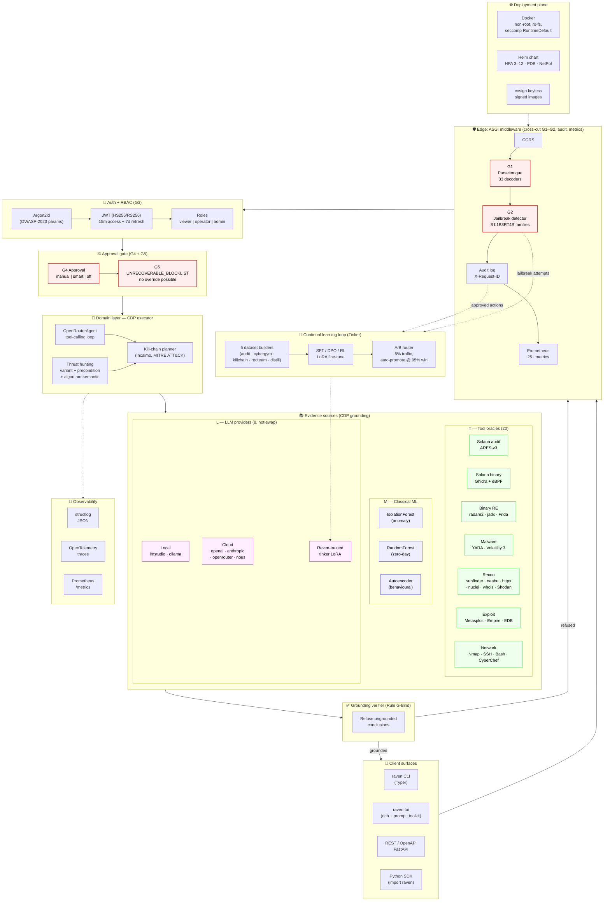

<p align="center">
  
</p>

# Project Raven — Architecture

## Overview

Project Raven is an autonomous defense system that transforms reactive security into proactive threat hunting. It combines a runtime-switchable multi-provider AI layer, ML anomaly + zero-day detection, Incalmo-style declarative kill-chain planning, and a closed continual-learning loop that lets the agent *get better with use*.

Five Hermes Agent-inspired safety primitives wrap the whole stack: JWT/RBAC auth, audit logging, an approval gate with a hardline `UNRECOVERABLE_BLOCKLIST`, an inbound jailbreak detector, and a gated offensive red-team capability. Production safety guards refuse insecure defaults at startup.

---

## High-level architecture

Raven is organised in eight horizontal layers, each with a single responsibility. The five-layer safety gate (G1–G5) is a *vertical cross-cut* that wraps every request before it reaches any domain code.



### ASCII fallback (for non-mermaid renderers)

```
┌──────────────────────────────────────────────────────────────────────────────────┐
│  CLIENTS:   raven CLI  │  raven tui  │  REST/OpenAPI  │  Python SDK                │
└──────────────────────────────────┬───────────────────────────────────────────────┘
                                   ▼
┌──────────────────────────────────────────────────────────────────────────────────┐
│  EDGE MIDDLEWARE (cross-cut):                                                     │
│  ┌──────┐  ┌──────────────┐  ┌────────────┐  ┌──────────┐  ┌───────────┐         │
│  │ CORS │─►│ G1           │─►│ G2         │─►│ Audit    │─►│ Metrics    │         │
│  │      │  │ Parseltongue │  │ Jailbreak  │  │ log      │  │ Prometheus │         │
│  │      │  │ 33 decoders  │  │ detector   │  │ X-Req-ID │  │ /metrics   │         │
│  └──────┘  └──────────────┘  └────────────┘  └──────────┘  └───────────┘         │
└──────────────────────────────────┬───────────────────────────────────────────────┘
                                   ▼
┌──────────────────────────────────────────────────────────────────────────────────┐
│  AUTH + RBAC (G3):  Argon2id ─► JWT (15m + 7d) ─► viewer | operator | admin       │
└──────────────────────────────────┬───────────────────────────────────────────────┘
                                   ▼
┌──────────────────────────────────────────────────────────────────────────────────┐
│  APPROVAL GATE:                                                                   │
│   G4  manual | smart | off  ─►  G5  UNRECOVERABLE_BLOCKLIST  (no override)        │
└──────────────────────────────────┬───────────────────────────────────────────────┘
                                   ▼
┌──────────────────────────────────────────────────────────────────────────────────┐
│  DOMAIN (CDP executor):                                                            │
│   OpenRouterAgent  ◄──►  Threat hunting (variant/precond/alg-sem)                  │
│           │              │                                                         │
│           └─────► Kill-chain planner (Incalmo, MITRE ATT&CK)                       │
└──────────────────────────────────┬───────────────────────────────────────────────┘
                                   ▼
┌─────────────────────── EVIDENCE SOURCES (CDP grounding) ────────────────────────┐
│                                                                                   │
│  T — Tool oracles (20)                  M — Classical ML       L — LLM (8 prov.) │
│  ┌─────────────────────────────┐   ┌──────────────────┐   ┌─────────────────┐   │
│  │ ARES-v3 (Solana audit)      │   │ IsolationForest  │   │ Local:           │   │
│  │ Ghidra + eBPF Solana        │   │  (anomaly)       │   │  lmstudio/ollama │   │
│  │ radare2 · jadx · Frida      │   │ RandomForest     │   │ Cloud:           │   │
│  │ YARA · Volatility 3         │   │  (zero-day)      │   │  openai/anthropic│   │
│  │ subfinder · naabu · httpx   │   │ Autoencoder      │   │  openrouter/nous │   │
│  │ nuclei · whois · Shodan     │   │  (behavioural)   │   │ Raven-trained:   │   │
│  │ Metasploit · Empire · EDB   │   │                  │   │  tinker LoRA     │   │
│  │ Nmap · SSH · Bash · CChef   │   │                  │   │ (HOT-SWAP)       │   │
│  └─────────────────────────────┘   └──────────────────┘   └─────────────────┘   │
└──────────────────────────────────┬───────────────────────────────────────────────┘
                                   ▼
┌──────────────────────────────────────────────────────────────────────────────────┐
│  GROUNDING VERIFIER  (Rule G-Bind):                                                │
│   admissible? ─► return conclusion + evidence trace                                │
│   refused?    ─► 4xx with reason                                                   │
└────────────────┬─────────────────────────────────────────────────────────────────┘
                 │
                 ├──────► CONTINUAL-LEARNING LOOP (Tinker)                            
                 │        5 dataset builders ─► SFT/DPO/RL LoRA ─► A/B (5% → promote) 
                 │                                                                     
                 └──────► OBSERVABILITY                                                
                          structlog · OpenTelemetry · Prometheus                       

────────────────────── DEPLOYMENT PLANE ────────────────────────────────────────────
  Docker (non-root, read-only fs, seccomp)  ·  Helm (HPA, PDB, NetworkPolicy)         
  cosign keyless-signed images  ·  pre-commit (ruff/bandit/gitleaks)                  
  CI: lint + mypy + bandit + Trivy + pytest + helm lint + kubeval                     
```

### Layer summary

| # | Layer | Files / packages | Cross-cuts |
|---|-------|------------------|-----------|
| 1 | **Clients** | `raven/cli/` (Typer + Rich TUI), `raven/api/` (FastAPI) | — |
| 2 | **Edge middleware** | `raven/redteam/middleware.py`, `raven/api/middleware/` | G1, G2, audit, metrics |
| 3 | **Auth + RBAC** | `raven/auth/` | G3 |
| 4 | **Approval gate** | `raven/approval/` | G4, G5 |
| 5 | **Domain (CDP executor)** | `raven/ai/openrouter_agent.py`, `raven/hunters/` | — |
| 6 | **Evidence sources (T, M, L)** | `raven/tools/`, `raven/ml/`, `raven/ai/providers/` | grounded by verifier |
| 7 | **Grounding verifier** | `raven/ai/grounding_verifier.py` | Rule G-Bind |
| 8 | **Continual learning** | `raven/training/` (Tinker + Mock) | feeds layer 6 (`tinker` provider) |
| ⊥ | **Deployment** | `Dockerfile`, `deployment/helm/raven/`, `.github/workflows/` | wraps layers 1–8 |
| ⊥ | **Observability** | `raven/observability/` | wraps layers 2–8 |

---

## Architectural primitive — Compositional Defense Pipelines (CDP)

Raven is organised around a single primitive we call a **Compositional Defense Pipeline**: an auditable, directed graph in which every LLM-produced assertion is bound to one of three deterministic evidence sources before it can exit the agent.

```
user input
   │
   ▼  G1  Parseltongue obfuscation normaliser     (33 decoders)
   ▼  G2  Jailbreak fingerprint detector          (8 L1B3RT4S families)
   ▼  G3  RBAC                                    (viewer | operator | admin)
   │
   ▼     L   LLM plan (multi-provider, hot-swap)
   │
   ▼     T   Tool oracles (parallel, deterministic)
   │           ARES-v3 · YARA · radare2 · Ghidra · Nmap · …
   ▼     M   Classical-ML detectors
   │           IsolationForest · RandomForest · autoencoder
   │
   ▼     L   LLM summary with evidence trace
   │
   ▼  Grounding verifier (Rule G-Bind — refuses ungrounded claims)
   ▼  G4  Approval gate                           (manual | smart | off)
   ▼  G5  UNRECOVERABLE_BLOCKLIST                 (no override possible)
   │
   ▼  conclusion c, evidence E
```

**Three sources** ground every claim:

| Source | Set | Examples |
|--------|-----|----------|
| Tool oracle | `T` (20 adapters) | ARES-v3 (Solana audit) · YARA · radare2 · Ghidra · Volatility 3 · Nmap · CyberChef · … |
| Classical-ML detector | `M` | IsolationForest anomaly · RandomForest zero-day · autoencoder behavioural baseline |
| Scored LLM hypothesis | `L` (tagged) | Explicitly `unsourced=true` with confidence `s ∈ [0,1]` |

**Grounding rule (G-Bind):** an LLM conclusion is admissible iff it carries a non-empty evidence trace pointing to `T` or `M` outputs, *or* is explicitly tagged unsourced with a confidence score. The grounding verifier (`raven/ai/grounding_verifier.py`) enforces this on every LLM completion.

**Why this matters:** LLM hallucination is reduced to *tool fidelity*, a strictly easier and auditable problem. Every Raven finding can be traced to a specific `ToolResult` envelope.

See [`docs/methodology.md`](docs/methodology.md) for the operator summary, or the full whitepaper at [`docs/Whitepaper/`](docs/Whitepaper/README.md) for the formal grammar (§3), grounding theorem (§3.6), and empirical evaluation (§5).

---

## Core Components

### 1. Multi-Provider AI Layer

Provider-agnostic abstraction that hot-swaps LLM backends at runtime. Inspired by [Hermes Agent](https://github.com/NousResearch/hermes-agent) (`provider:model` shorthand) and [Claude Code](https://github.com/anthropics/claude-code) (`/model` switching).

```
raven/ai/
├── base.py                 BaseAIClient ABC + SUPPORTED_PROVIDERS catalogue
├── factory.py              create_client_from_config() — router
├── registry.py             ProviderRegistry singleton — thread-safe hot-swap + named profiles
├── model_orchestrator.py   FAST / REASON / VISION role routing
├── lmstudio_client.py      Backward-compat shim
└── providers/
    ├── lmstudio.py           LM Studio native v1 API + OpenAI-compat fallback
    ├── openai_compat.py      OpenAI / OpenRouter / Ollama / Nous / OpenCode
    ├── anthropic_provider.py Anthropic native SDK (graceful degradation)
    └── tinker_provider.py    Raven-trained LoRA fine-tunes via Tinker
```

**Supported providers:**

| Provider | Transport | Key | Notes |
|---|---|---|---|
| `lmstudio` | LM Studio native v1 | — | Local default |
| `openai` | OpenAI-compat | ✅ | |
| `openrouter` | OpenAI-compat | ✅ | 300+ models |
| `anthropic` | Anthropic SDK | ✅ | |
| `ollama` | OpenAI-compat | — | Local |
| `nous` | OpenAI-compat | ✅ | Hermes models |
| `opencode` | OpenAI-compat | ✅ | |
| `tinker` | Tinker SDK / OpenAI-compat | ✅ | Raven-trained fine-tunes |

**Runtime switching** — CLI `raven provider set …` or `POST /ai/provider` (admin). `base_url` validated against `AI_ALLOWED_BASE_URLS` allowlist to close credential-exfil class.

### 2. Authentication & RBAC

```
raven/auth/
├── models.py         User, Role (viewer | operator | admin), TokenPair
├── password.py       Argon2id hashing (OWASP 2023 params: t=2, m=19_456, p=1)
├── jwt_manager.py    HS256/RS256 + access (15m) + refresh (7d) + revocation set
├── user_store.py     Thread-safe in-memory store (Phase 3 → SQLAlchemy)
├── dependencies.py   FastAPI Depends(current_user) + require_role()
└── routes.py         /auth/login /auth/refresh /auth/logout /auth/me
```

**Role hierarchy:** `admin > operator > viewer`. Every mutating route declares `Depends(require_admin)` or `Depends(require_operator)`. Refresh-token rotation on every `/auth/refresh` + revocation set guard against theft.

### 3. Approval Gate (Hermes-style)

```
raven/approval/
├── models.py         ApprovalMode (manual/smart/off), ApprovalVerdict
├── patterns.py       DANGEROUS_PATTERNS + UNRECOVERABLE_BLOCKLIST
├── store.py          PendingApprovalStore + AllowlistStore
├── smart.py          SmartApprover — LLM-assisted risk triage
├── gate.py           ApprovalGate singleton — decision orchestrator
└── dependencies.py   approval_required() factory for FastAPI routes
```

**Evaluation order for every dangerous command:**
1. `UNRECOVERABLE_BLOCKLIST` — `rm -rf /`, fork bomb, `mkfs /dev/sd*`, `dd of=/dev/sd*`, `curl|sh`. **No override possible.** Not even YOLO + admin.
2. Permanent allowlist — operator-approved regex patterns.
3. Dangerous-pattern match — branches on `ApprovalMode`:
   - `manual` → enqueue `PendingApproval`, return 202 with `request_id` for operator polling
   - `smart` → `ModelOrchestrator(FAST)` triages → auto-approve / auto-deny / escalate to manual
   - `off` (YOLO) → auto-approve. **Refused in prod by the safety validator.**

### 4. Red-Team Subsystem

```
raven/redteam/
├── normalizer.py             ParseltongueNormaliser (33 obfuscation decoders)
├── jailbreak_patterns.py     Fingerprint library (8 L1B3RT4S families)
├── detector.py               JailbreakDetector — weighted score 0..1
├── middleware.py             Buffers inbound /ai/* /hunt/* bodies → scans → blocks
├── hardness_test.py          ProviderHardnessTest — 10 canaries → 0–10 score
└── offensive.py              OffensiveGodmode (triple-gated, default off)
```

**Defensive pipeline (always on):**
1. Inbound prompt → `ParseltongueNormaliser` decodes zero-width / leetspeak / Unicode homoglyphs / Base64 / hex / Braille / Morse / Pig Latin / math alphabets / brackets / acrostic.
2. Decoded text → fingerprint scan against L1B3RT4S patterns (boundary_inversion, refusal_inversion, og_godmode, unfiltered_liberated, dan, injection, role_play, content).
3. Score ≥ `JAILBREAK_BLOCK_THRESHOLD` → 403 + `X-Raven-Jailbreak-Score` header on response.

**Hardness test (admin):** `POST /redteam/hardness` runs 10 canary jailbreaks against the active provider → resistance score with weakest-family breakdown.

**Offensive Godmode (triple-gated, default off):** requires (a) `OFFENSIVE_REDTEAM_ENABLED=true`, (b) admin role, (c) `X-Raven-Authorization-Token` matching `OFFENSIVE_REDTEAM_SESSION_TOKEN` via `hmac.compare_digest`, (d) `sandbox_session_id` in body. Strategies are synthesised at runtime — L1B3RT4S templates are NOT redistributed.

### 5. Continual Learning (Tinker)

```
raven/training/
├── client.py                 TinkerClient (lazy SDK) + MockTinkerClient (offline)
├── models.py                 Dataset, TrainingJob, ModelVersion, ABTestRun
├── datasets/
│   ├── base.py                 JsonlWriter + pii_scrub
│   ├── from_audit_log.py       Mutation history → SFT pairs
│   ├── from_cybergym.py        CyberGym verdicts → RL trajectories
│   ├── from_killchain.py       Approved tasks → tool-use SFT
│   ├── from_redteam.py         Jailbreaks → DPO (chosen, rejected)
│   └── distillation.py         Teacher → student corpus
├── jobs/                       DistillJob · SFTJob · CodeRLJob
├── registry.py                 ModelRegistry — versions/jobs/abtests/datasets
├── secrets.py                  FernetVault — encrypted-at-rest TINKER_API_KEY
├── eval.py                     Hardness + canary + CyberGym smoke
└── abtest.py                   Bernoulli router with auto-promote/rollback
```

**Loop:** audit log + CyberGym verdicts + kill-chain approvals → JSONL → Tinker LoRA fine-tune → `ModelVersion` row → eval → A/B test (5% traffic, 95% win threshold) → auto-promote / auto-rollback.

**Mock-friendly:** `MockTinkerClient` replays a 3-tick state machine when `TINKER_API_KEY` is absent — entire pipeline runs offline for CI and hackathon demos.

### 6. Threat Detection Engine (ML/AI Core)
- **Anomaly Detection**: Isolation Forest + Autoencoders. `load_model()` gated by `ALLOW_PICKLE_MODELS` + `MODEL_PATH` jail.
- **Signature-Based Detection**: Known pattern matching.
- **Zero-Day Prediction**: Ensemble (IsolationForest + RandomForest). `load_models()` gated the same way.
- **Behavioral Profiling**: Baseline + deviation flagging.

### 7. Tool Orchestration Layer (the `T` set in CDP)

All 20 tool oracles inherit from `raven.tools.adapter_base.ToolAdapter` and return a uniform `ToolResult` envelope.  Adapter map in `raven/api/routes_tools.py::_load_adapters()`.

- **Smart-contract auditing**
  - `AresAdapter` — [ARES-v3](https://github.com/daemon-blockint-tech/ARES-v3) deterministic Solana static auditor. 97 % micro-recall, 0.94 F1, sub-5-sec scans, zero API cost. Detects 12 classes: type-cosplay, ownership-check, signer-authorization, arbitrary-cpi, reentrancy-risk, arithmetic-overflow, close-account, account-reloading, and 4 more. Exposed as agent tool `solana_audit`, REST `POST /tools/ares/call`, CLI `raven tools ares <path>`.
  - `EBPFGhidraSetup` — [Solana-eBPF-for-Ghidra](https://github.com/blastrock/Solana-eBPF-for-Ghidra) Ghidra processor extension. Decompiles compiled Solana `.so` BPF programs. Agent tool `ebpf_ghidra_status`, CLI `raven tools ebpf-ghidra`.
- **Binary analysis** — `GhidraAnalyzer`, `Radare2Adapter`, `JadxAdapter`, `FridaAdapter`, `VolatilityAdapter`.
- **Malware** — `YaraScanner` (Python module + CLI fallback).
- **Recon** — `SubfinderAdapter`, `NaabuAdapter`, `HttpxAdapter`, `InteractshAdapter`, `NucleiScanner`, `ReconNgAdapter`, `WhoisClient`, `ShodanClient`.
- **Exploitation** — `MetasploitIntegration`, `EmpireClient`, `SearchsploitAdapter`.
- **Network** — `NmapScanner`; `SSHManager` (`paramiko.RejectPolicy` + operator-supplied `known_hosts`, no `AutoAddPolicy`); `BashExecutor` (`shell=False` default with `shlex.split`).
- **Data ops** — `CyberchefAdapter` (HTTP to gchq/CyberChef server).
- **Remediation engine** — patch IDs regex-validated + `shlex.quote`-wrapped.
- **Containment actions** — pid coerced to positive `int` — no string interpolation into `kill -9`.

Full catalogue, install instructions, and `install_hint` strings: [`docs/tools.md`](docs/tools.md).

### 8. Proactive Threat Hunting Module

Implements the three techniques described in Anthropic's Claude Opus 4.6 zero-day research:
- **Variant analysis** — `raven/ml/variant_analyzer.py` mines git history for security commits, finds sibling code lacking the fix
- **Precondition reasoning** — extracts control-flow constraints around dangerous patterns
- **Algorithm-semantic mining** — surfaces implicit invariants in compression / parser / crypto code

Plus Incalmo-style declarative kill-chain planning (`raven/hunters/kill_chain_planner.py`) with MITRE ATT&CK alignment and HITL approval on destructive stages (exploitation, lateral movement, exfiltration, privilege escalation, post-exploitation).

### 9. Mitigation Response
- Containment (process kill via SSH, IP block)
- Remediation (apt-get patch, configuration hardening)
- Response orchestrator chains containment + remediation per threat type

### 10. Observability

```
raven/observability/
├── logging.py     structlog JSON in prod, console in dev. Request ID propagated.
├── metrics.py     Prometheus exposition + MetricsMiddleware
└── tracing.py     OpenTelemetry auto-instrumentation when OTEL_ENDPOINT set
```

**25+ metrics** including request latency, AI tokens prompt/completion, provider switches, kill-chain stages, approval verdicts, blocklist hits, jailbreak detections, provider hardness, training jobs, A/B win rates.

### 11. Production Safety

`raven/config/__init__.py` runs a `_enforce_secret_key_floor` validator on every start and `_enforce_prod_safety` when `RAVEN_ENVIRONMENT=prod`. Refuses to boot when:

| Condition | All envs | Prod only |
|---|---|---|
| `SECRET_KEY` is the dev default | ✅ unless `ALLOW_INSECURE_DEFAULTS=true` | also refuses the opt-in itself |
| `DEBUG=true` | — | ✅ |
| `CORS_ORIGINS` contains `*` or is unset | — | ✅ |
| `APPROVAL_MODE=off` (YOLO) | — | ✅ |
| `OFFENSIVE_REDTEAM_ENABLED=true` without session token | ✅ | ✅ |
| `CONTINUAL_LEARNING_ENABLED=true` without `TINKER_API_KEY` | ✅ | ✅ |

---

## End-to-end request flow

```
                  ┌────────────────────────────────────┐
   HTTP request ─►│  CORSMiddleware                    │
                  └────────────────┬───────────────────┘
                                   ▼
                  ┌────────────────────────────────────┐
                  │  JailbreakDetectionMiddleware       │
                  │  Parseltongue.normalise → score     │
                  │  403 if ≥ threshold                 │
                  └────────────────┬───────────────────┘
                                   ▼
                  ┌────────────────────────────────────┐
                  │  AuditLogMiddleware                 │
                  │  X-Request-ID propagation +         │
                  │  per-mutation audit entry           │
                  └────────────────┬───────────────────┘
                                   ▼
                  ┌────────────────────────────────────┐
                  │  MetricsMiddleware                  │
                  │  Prometheus latency + count         │
                  └────────────────┬───────────────────┘
                                   ▼
                  ┌────────────────────────────────────┐
                  │  Route handler                      │
                  │  Depends(current_user) →            │
                  │  Depends(require_admin/operator)    │
                  └────────────────┬───────────────────┘
                                   ▼
                  ┌────────────────────────────────────┐
                  │  ApprovalGate.check() if dangerous  │
                  │  UNRECOVERABLE_BLOCKLIST →          │
                  │  Allowlist → mode-specific          │
                  └────────────────┬───────────────────┘
                                   ▼
       ┌───────────────────────────┼───────────────────────────┐
       │ Domain layer              │                            │
       │  ┌─────────────┐  ┌──────────────┐  ┌──────────────┐  │
       │  │ Hunting     │  │ ML/AI engine │  │ Tools         │  │
       │  │ Hypothesis  │  │ Anomaly      │  │ SSH (Reject)  │  │
       │  │ Kill-chain  │  │ Zero-day     │  │ Bash (no sh)  │  │
       │  └──────┬──────┘  └──────┬───────┘  │ Nmap/Nuclei   │  │
       │         │                │           └───────────────┘  │
       │         └────────┬───────┘                              │
       │                  ▼                                       │
       │   ┌──────────────────────────────────────────────────┐  │
       │   │ Multi-Provider AI Layer                          │  │
       │   │  ProviderRegistry singleton (hot-swap)            │  │
       │   │  lmstudio · openai · anthropic · openrouter ·     │  │
       │   │  ollama · nous · opencode · TINKER                │  │
       │   │  System prompt injected by _build_messages        │  │
       │   └──────────────────────────────────────────────────┘  │
       └────────────────────────────┬─────────────────────────────┘
                                    ▼
                  ┌────────────────────────────────────┐
                  │  Mitigation                         │
                  │  Containment + Remediation          │
                  └────────────────┬───────────────────┘
                                   ▼
                  ┌────────────────────────────────────┐
                  │  Telemetry                          │
                  │  audit · prom · structlog · OTel    │
                  │  + (if approved) Tinker training-    │
                  │  data candidate                     │
                  └────────────────────────────────────┘
```

---

## Technology Stack

### Core
- **Language:** Python 3.11+
- **API:** FastAPI + Pydantic v2
- **CLI:** Typer (`raven {provider, model, prompt, approval, redteam, train}`)
- **Pkg:** uv-friendly, pinned `requirements.txt`

### AI / LLM
- **Local:** LM Studio (native v1), Ollama (OpenAI-compat)
- **Cloud:** OpenAI, Anthropic, OpenRouter, Nous, OpenCode
- **Trained:** Tinker (Llama-3.1, Qwen-2.5) — Raven's own fine-tunes
- **Abstraction:** `BaseAIClient` ABC with shared task helpers
- **Hot-swap:** `ProviderRegistry` singleton — REST or CLI, no restart

### Security primitives
- **Auth:** PyJWT (HS256/RS256), Argon2id (`argon2-cffi`)
- **Rate-limit:** `slowapi`
- **Crypto-at-rest:** Fernet (`cryptography`) for `TINKER_API_KEY`

### ML
- **Frameworks:** PyTorch, scikit-learn, TensorFlow, numpy, pandas, scipy
- **Models:** Isolation Forest, RandomForest, Autoencoders, LSTM, Transformers
- **Graph:** NetworkX for attack-graph mapping

### Security tools
- Nmap (`python-nmap`), Metasploit (`pymetasploit3`), Nuclei (subprocess), Empire C2 (HTTP), Ghidra (`pyghidra` / headless), Shodan (`shodan` SDK), YARA, Suricata, Scapy

### Observability
- **Logs:** `structlog` (JSON in prod, console in dev)
- **Metrics:** `prometheus_client` — `/metrics` exposition
- **Tracing:** OpenTelemetry — FastAPI + requests auto-instrumentation

### Data plane
- **Persistence:** PostgreSQL + TimescaleDB (Phase 3, planned), in-memory thread-safe stores today
- **Cache / queue:** Redis (jwt revocation), Celery
- **Streaming:** Kafka (planned)

### Infrastructure
- **Containers:** Docker multi-stage, distroless-ish runtime, non-root (uid 10001)
- **Orchestration:** Kubernetes via bundled Helm chart at `deployment/helm/raven/`
- **Security context:** runAsNonRoot, readOnlyRootFilesystem, drop ALL caps, seccomp `RuntimeDefault`
- **Networking:** Ingress + cert-manager + NetworkPolicy (deny-all + allowlisted egress)
- **HA:** HPA 3–12 replicas, PodDisruptionBudget `minAvailable: 2`, topologySpreadConstraints across zones

### CI/CD
- **GitHub Actions:** lint (ruff) + type-check (mypy) + bandit + Trivy + pytest (3.11/3.12) + helm lint + kubeval
- **Release:** multi-arch image (amd64+arm64) + cosign keyless signing + Helm chart OCI push
- **Pre-commit:** ruff, bandit, gitleaks

---

## Tests

**224 passed, 24 skipped** as of `f767416`:

```
tests/test_ai_factory.py            18  Multi-provider factory + parser
tests/test_anomaly_detector.py       7  ML core
tests/test_approval.py              34  Approval gate + blocklist + modes
tests/test_auth.py                  23  JWT + Argon2 + role hierarchy
tests/test_behavioral_profiler.py    4
tests/test_empire_client.py          7
tests/test_provider_registry.py     19  Hot-swap + profiles
tests/test_nuclei_scanner.py         5
tests/test_redteam.py               18  Parseltongue + detector + offensive gating
tests/test_security_findings.py     21  F1-F6 regression
tests/test_system_prompt.py         30  Prompt injection / load / scoping
tests/test_threat_detector.py        4
tests/test_training.py              31  Datasets + jobs + registry + ABTest + Fernet
tests/test_vuln_fixes.py            17  VULN-1/3/4 regression
```

Pre-existing `tests/test_ghidra_analyzer.py` is env-coupled (requires absence of `/opt/ghidra`) and skipped here.

---

## Reference research

| Source | Used for |
|---|---|
| [Incalmo](https://arxiv.org/abs/2501.16466) | Declarative kill-chain planner |
| [ZeroDayBench](https://arxiv.org/abs/2603.02297) | Dangerous-pattern grep library |
| [CyberGym](https://arxiv.org/abs/2506.02548) | Vulnerability benchmark (integration planned) |
| [Anthropic 0-days](https://red.anthropic.com/2026/zero-days/) | Variant + precondition + algorithm-semantic techniques |
| [Hermes Agent](https://github.com/NousResearch/hermes-agent) | YOLO + approval modes + G0DM0D3 fingerprints |
| [Tinker](https://thinkingmachines.ai/tinker/) | Managed LoRA fine-tuning |
| [ARES-v3](https://github.com/daemon-blockint-tech/ARES-v3) | Deterministic Solana smart-contract static auditor (`solana_audit` tool oracle) |
| [Solana-eBPF-for-Ghidra](https://github.com/blastrock/Solana-eBPF-for-Ghidra) | Ghidra processor for compiled Solana `.so` programs |
| [WRECK-IT 7.0](https://wreckit.id) | Subtema 1 — Autonomous Defense & AI-Driven Threat Hunting |

---

## Further reading

- **Methodology summary** — [`docs/methodology.md`](docs/methodology.md)
- **Whitepaper (full)** — [`docs/Whitepaper/`](docs/Whitepaper/README.md)
  - §3 Compositional Defense Pipelines — formal grammar + grounding theorem
  - §5 Empirical evaluation (5 axes, replication scripts in `bench/whitepaper/`)
  - §6 Case studies (Anchor audit, compiled `.so` triage)
- **Tools catalogue** — [`docs/tools.md`](docs/tools.md)
- **Approval & red-team operator guide** — [`docs/approval-and-redteam.md`](docs/approval-and-redteam.md)
- **Training pipeline** — [`docs/training.md`](docs/training.md)
