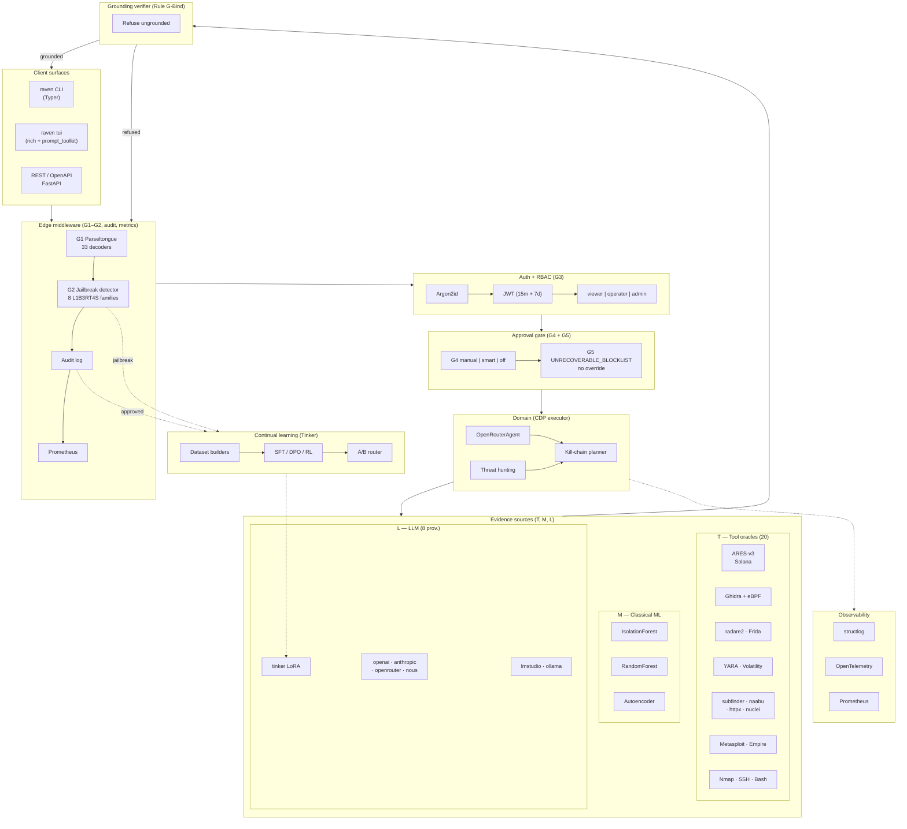

# 4. Implementation

The reference implementation of CDP is open-source Python 3.11+, FastAPI, and a small Typer-based CLI. This section describes the concrete module layout, the unified tool-adapter contract, the provider registry, and the production deployment.

## 4.1 High-level architecture

Raven's reference implementation follows the eight-layer model described in §3 and visualised below:



### Layer mapping to code

| # | Layer | Code location |
|---|-------|---------------|
| 1 | Clients | `raven/cli/`, `raven/api/` |
| 2 | Edge middleware | `raven/redteam/middleware.py`, `raven/api/middleware/` |
| 3 | Auth + RBAC | `raven/auth/` |
| 4 | Approval gate | `raven/approval/` |
| 5 | Domain (CDP executor) | `raven/ai/openrouter_agent.py`, `raven/hunters/` |
| 6 | Evidence sources (T, M, L) | `raven/tools/`, `raven/ml/`, `raven/ai/providers/` |
| 7 | Grounding verifier | `raven/ai/grounding_verifier.py` |
| 8 | Continual learning | `raven/training/` |
| ⊥ | Deployment | `Dockerfile`, `deployment/helm/raven/` |
| ⊥ | Observability | `raven/observability/` |

---

## 4.2 Repository layout

```
raven/
├── ai/                  # Multi-provider LLM layer (the L set)
│   ├── base.py            BaseAIClient ABC
│   ├── factory.py         create_client_from_config()
│   ├── registry.py        ProviderRegistry singleton (hot-swap)
│   ├── model_orchestrator.py
│   ├── openrouter_agent.py    Tool-calling agent w/ CDP grounding
│   └── providers/
├── tools/               # Tool oracles (the T set)
│   ├── adapter_base.py    ToolAdapter ABC + ToolResult
│   ├── ares.py            ARES-v3 Solana auditor              ◄ NEW
│   ├── ebpf_ghidra.py     Solana eBPF Ghidra setup helper     ◄ NEW
│   ├── ghidra_analyzer.py
│   ├── projectdiscovery.py (subfinder / naabu / httpx / interactsh)
│   ├── exploitdb.py · recon_ng.py · yara_scan.py · jadx.py
│   ├── radare2.py · frida.py · volatility.py · cyberchef.py
│   ├── whois_client.py · nmap_scanner.py · metasploit_integration.py
│   ├── empire_client.py · nuclei_scanner.py · shodan_client.py
│   └── mcp_registry.py    MCP server catalogue
├── ml/                  # Classical-ML detectors (the M set)
│   ├── anomaly_detector.py    IsolationForest + autoencoder
│   ├── zero_day_predictor.py  IsolationForest + RandomForest
│   ├── behavioral_profiler.py
│   └── variant_analyzer.py    Git-history mining
├── approval/            # G3, G4, G5
│   ├── patterns.py        DANGEROUS_PATTERNS + UNRECOVERABLE_BLOCKLIST
│   ├── gate.py            ApprovalGate singleton
│   └── smart.py           LLM-assisted triage
├── redteam/             # G1, G2
│   ├── normalizer.py      Parseltongue 33-decoder normaliser
│   ├── jailbreak_patterns.py  L1B3RT4S fingerprint library
│   ├── detector.py        Weighted score 0..1
│   ├── middleware.py      FastAPI middleware
│   └── hardness_test.py   Provider 0..10 resistance score
├── auth/                # JWT + Argon2id + RBAC
├── hunters/             # Hypothesis generator + kill-chain planner
├── training/            # Tinker LoRA continual-learning loop
├── api/                 # FastAPI app + REST routers
├── cli/                 # Typer CLI + TUI (rich + prompt_toolkit)
│   ├── main.py
│   ├── commands/{provider,model,prompt,approval,redteam,
│   │             train,agent,tools,tui}.py
│   └── tui/{app,widgets,slash_commands}.py
├── observability/       # structlog + Prometheus + OpenTelemetry
└── config/              # Pydantic settings + production safety guards

deployment/helm/raven/   # Kubernetes Helm chart
docs/                    # Operator + tools docs + this whitepaper
tests/                   # 286 unit tests
bench/whitepaper/        # Replication scripts for §5 + §6
```

Total: 38 014 LoC Python (excluding tests), 286 unit tests passing, MIT licence.

## 4.2 Tool oracle layer (\(\mathcal{T}\))

Every tool inherits from a single ABC:

```python
class ToolAdapter:
    binary: str          # binary name on PATH or absolute path
    tool_name: str       # human-readable identifier
    install_hint: str    # surfaced in failure messages

    def is_available(self) -> bool: ...
    def _run(self, cmd: List[str], target: str, timeout: int) -> ToolResult: ...
```

Adapters are registered in `raven/api/routes_tools.py::_load_adapters()` and resolved lazily on import. The 20 currently-registered tools are:

**Table 4.1 — Tool oracles in \(\mathcal{T}\)**

| ID | Adapter | Class of analyser | Source upstream |
|----|---------|-------------------|-----------------|
| `ares` | `AresAdapter` | Solana smart-contract static auditor | [daemon-blockint-tech/ARES-v3] |
| `ebpf_ghidra` | `EBPFGhidraSetup` | Solana `.so` BPF decompilation | [blastrock/Solana-eBPF-for-Ghidra] |
| `ghidra` | `GhidraAnalyzer` | Binary analysis (analyzeHeadless) | NSA Ghidra |
| `radare2` | `Radare2Adapter` | Binary analysis + r2ghidra decomp | radareorg/radare2 |
| `yara` | `YaraScanner` | Malware family signatures | VirusTotal/yara |
| `jadx` | `JadxAdapter` | APK / DEX decompiler | jadx upstream |
| `frida` | `FridaAdapter` | Dynamic instrumentation | frida/frida |
| `volatility` | `VolatilityAdapter` | Memory forensics | volatilityfoundation/volatility3 |
| `cyberchef` | `CyberchefAdapter` | Multi-recipe data ops | gchq/CyberChef |
| `subfinder` | `SubfinderAdapter` | Subdomain enumeration | projectdiscovery |
| `naabu` | `NaabuAdapter` | Port scanner | projectdiscovery |
| `httpx` | `HttpxAdapter` | HTTP probe | projectdiscovery |
| `interactsh` | `InteractshAdapter` | OOB interaction | projectdiscovery |
| `nuclei` | `NucleiScanner` | Vulnerability templates | projectdiscovery |
| `nmap` | `NmapScanner` | Network discovery | nmap.org |
| `exploitdb` | `SearchsploitAdapter` | Exploit-DB search | offensive-security |
| `recon_ng` | `ReconNgAdapter` | OSINT reconnaissance | lanmaster53 |
| `metasploit` | `MetasploitIntegration` | Exploitation framework | rapid7 |
| `empire` | `EmpireClient` | C2 framework | BC-SECURITY |
| `shodan` | `ShodanClient` | Internet-wide scan data | shodan.io |
| `whois` | `WhoisClient` | Domain / IP registration | python-whois |

The unified interface means an LLM tool plan is provider- and tool-agnostic: it just emits `{tool, method, kwargs}` triples that resolve at runtime against the adapter map.

## 4.3 Provider layer (\(\mathcal{L}\))

Eight LLM providers are exposed under `raven/ai/providers/` and routed by `ProviderRegistry`:

**Table 4.2 — LLM providers in \(\mathcal{L}\)**

| Provider | Transport | Key | Example models | Hot-swap |
|----------|-----------|-----|----------------|----------|
| `lmstudio` | LM Studio native v1 | none (local) | `ibm/granite-4-micro` | ✓ |
| `ollama` | OpenAI-compat | none (local) | `llama3.2`, `deepseek-r1` | ✓ |
| `openai` | OpenAI SDK | ✓ | `gpt-4o`, `o3-mini` | ✓ |
| `anthropic` | Anthropic SDK | ✓ | `claude-opus-4-5` | ✓ |
| `openrouter` | OpenAI-compat | ✓ | 300+ models | ✓ |
| `nous` | OpenAI-compat | ✓ | `nous-hermes-2-mixtral-8x7b` | ✓ |
| `opencode` | OpenAI-compat | ✓ | — | ✓ |
| `tinker` | Tinker SDK / OpenAI-compat | ✓ | Raven-trained LoRA fine-tunes | ✓ |

All eight inherit `BaseAIClient`, share helpers for `chat()`, `embed()`, and `task()`, and are swapped at runtime via `POST /ai/provider` (admin-only) or `raven provider set <provider:model>` (CLI). Named profiles are persisted to `~/.raven/profiles.json` so an operator can save (`raven provider save work`) and recall (`raven provider use work`) full configurations.

## 4.4 Agent loop (CDP executor)

`raven/ai/openrouter_agent.py::OpenRouterAgent` implements the CDP executor. The loop:

```
1. user_message ─► _build_messages() (system prompt injected)
2. for step in 1..MAX_STEPS:
     a. completion = provider.chat(messages, tools=registered_tools)
     b. if completion.tool_calls:
          for call in tool_calls:
            result = tool_registry.dispatch(call.name, call.arguments)
            messages.append(tool_result)
        else:
          break (final assistant message)
3. verify grounding (Rule G-Bind)
4. emit conclusion + evidence trace
```

The agent registers `solana_audit` (→ ARES-v3), `ebpf_ghidra_status` (→ Ghidra extension check), `whois`, `searchsploit`, `nmap_scan`, `yara_scan`, and others as callable `tool_call_id`-bearing functions following the OpenAI tool-calling schema. The same agent serves the FastAPI `/agent/chat` route, the CLI `raven agent chat` REPL, and the TUI `raven tui`.

## 4.5 Safety gate plumbing

The five gates run as FastAPI middleware (Parseltongue + JailbreakDetector + Audit + Metrics) followed by `Depends(...)` route declarations (RBAC) and an explicit `ApprovalGate.check()` call inside any destructive endpoint:

```
HTTP request
  → CORSMiddleware
  → JailbreakDetectionMiddleware       (G1 + G2)
  → AuditLogMiddleware
  → MetricsMiddleware
  → route handler
      → Depends(require_admin / require_operator)   (G3)
      → ApprovalGate.check(action, mode)            (G4 + G5)
      → domain code (which may invoke L, T, M)
```

The order is intentional: a malicious payload is **normalised and scored before any state mutation can be triggered**, before any logs are written, and before any RBAC decision is taken.

## 4.6 Continual learning

`raven/training/` realises the Tinker-mediated loop. Five dataset builders (`from_audit_log`, `from_cybergym`, `from_killchain`, `from_redteam`, `distillation`) write JSONL with PII scrubbing. Three job types (`DistillJob`, `SFTJob`, `CodeRLJob`) submit to Tinker. The `ABTestRun` runs Bernoulli traffic splits with auto-promotion at 95 % win-rate threshold and auto-rollback on regression. The `MockTinkerClient` replays a 3-tick state machine so the entire pipeline runs offline; this is essential for CI and for environments without Tinker access.

The `TINKER_API_KEY` is encrypted at rest via Fernet (`raven/training/secrets.py`), never echoed to logs.

## 4.7 Observability

- **Structured logs** — `structlog` JSON in production, console in development. `X-Request-ID` propagated end-to-end.
- **Prometheus metrics** — 25+ counters/gauges/histograms exposed at `/metrics`: request latency, prompt/completion tokens per provider, provider hot-swaps, kill-chain stages, approval verdicts, blocklist hits, jailbreak detections, hardness scores, training jobs, A/B win rates.
- **OpenTelemetry tracing** — auto-instrumented FastAPI and `requests`, exporter configured via `OTEL_ENDPOINT`.

## 4.8 Production deployment

- **Docker** — multi-stage build, distroless-ish runtime, non-root uid 10001, `runAsNonRoot`, `readOnlyRootFilesystem`, drop all caps, seccomp `RuntimeDefault`.
- **Kubernetes** — Helm chart at `deployment/helm/raven/`. HPA 3–12 replicas, PodDisruptionBudget `minAvailable: 2`, topologySpreadConstraints across zones, NetworkPolicy deny-all + allowlisted egress, ServiceMonitor for Prometheus, cert-manager + Ingress.
- **Supply chain** — pre-commit (ruff, bandit, gitleaks), CI lint + mypy + bandit + Trivy + pytest 3.11/3.12 + helm lint + kubeval, multi-arch image build, **cosign keyless signing** on release.

## 4.9 Production safety guard

`raven/config/__init__.py::_enforce_prod_safety` refuses to start when `RAVEN_ENVIRONMENT=prod` and any of the following hold:

| Refused condition |
|-------------------|
| `SECRET_KEY` is the dev default |
| `DEBUG=true` |
| `CORS_ORIGINS` contains `*` or is unset |
| `APPROVAL_MODE=off` (YOLO) |
| `OFFENSIVE_REDTEAM_ENABLED=true` without `OFFENSIVE_REDTEAM_SESSION_TOKEN` |
| `CONTINUAL_LEARNING_ENABLED=true` without `TINKER_API_KEY` |

This guard converts the most common production misconfigurations into start-up errors rather than silent runtime failures.

## 4.10 CLI & TUI

The Typer-based CLI exposes the full surface:

```
raven --help
  agent       Chat with the OpenRouterAgent (CDP loop)
  approval    Manage approval queue + modes
  model       Switch active model
  provider    Manage providers + named profiles
  prompt      System-prompt loader/scoper
  redteam     Run hardness test + (gated) offensive
  tools       Invoke tool oracles directly
              · list, whois, searchsploit, ares, ebpf-ghidra, run
  train       Trigger training jobs + A/B + promotion
  tui         Launch the Rich + prompt_toolkit TUI
```

The TUI (`raven tui`) is a claude-code-style interactive terminal with a Pillow-rendered PNG splash banner, streaming agent output, slash commands (`/help`, `/clear`, `/model`, `/run`, `/save`, `/load`, `/exit`), and history persistence at `~/.raven/tui_history`.
