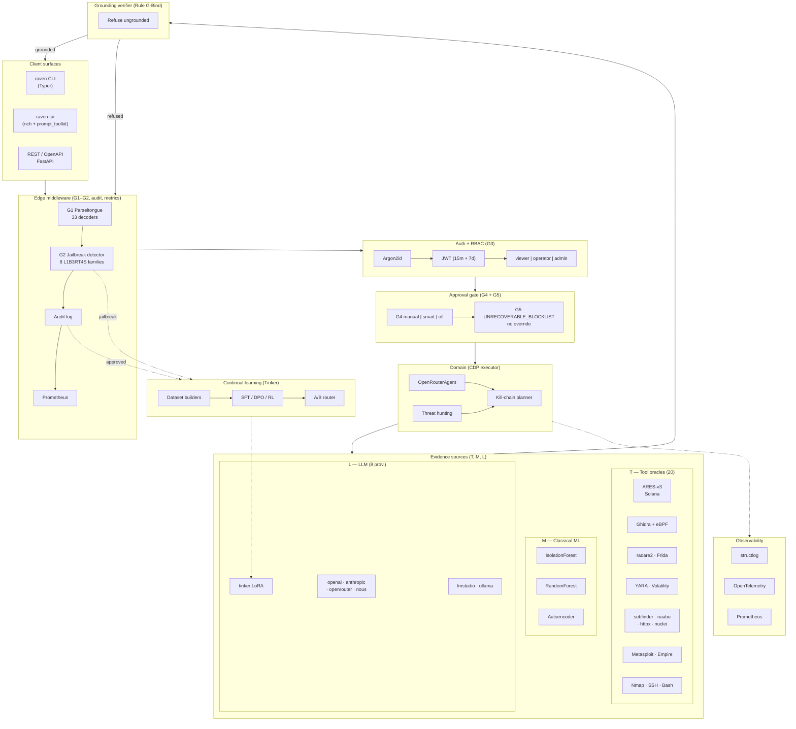

# Project Raven Whitepaper

> **Raven: Compositional Defense Pipelines — A Tool-Grounded, Multi-Provider AI Architecture for Autonomous Adversarial Defense**

*Working draft · v0.1 · May 2026*

---

# 0. Abstract

## Abstract

Large-language-model (LLM) agents have rapidly become viable for offensive and defensive cybersecurity tasks, yet two recurring failure modes have prevented their deployment in high-assurance environments: **hallucinated reasoning** untethered from deterministic evidence, and **single-provider lock-in** that turns the LLM substrate into a liveness, cost, and policy single point of failure. We present **Project Raven**, an open-source autonomous defense system built around a novel architectural primitive we call **Compositional Defense Pipelines (CDP)**.

A CDP is a directed, auditable pipeline in which every LLM-produced assertion is required to terminate at one of three deterministic evidence sources: (1) a *tool oracle* — a subprocess-invoked, structurally-typed security analyser such as **ARES-v3** for Solana smart contracts, **YARA** for malware, **radare2** / **Ghidra (+ Solana eBPF processor)** for binaries, or **Nmap** / **Nuclei** for network reconnaissance; (2) a *classical-ML detector* — an IsolationForest / RandomForest / autoencoder ensemble trained on labelled corpora; or (3) a *scored LLM hypothesis* explicitly cross-validated against (1) and (2). Pipelines compose under a five-layer safety gate (Parseltongue obfuscation normalisation → jailbreak fingerprinting → RBAC → tiered approval → an irreversible-action blocklist) and execute against a runtime-switchable multi-provider abstraction that hot-swaps eight LLM backends without restart.

We make four contributions: **(i)** a formal grammar and verifier for CDP pipelines that allows automated audit of LLM reasoning chains; **(ii)** a tool-grounding layer that integrates 20+ heterogeneous security analysers under a single `ToolAdapter` interface, including first-class support for deterministic Solana auditing via ARES-v3 (97 % micro-recall, 0.94 F1 on a 20-protocol benchmark) and Solana eBPF binary decompilation via a Ghidra processor extension; **(iii)** an empirical evaluation across five evaluation axes — *tool-grounding fidelity*, *jailbreak resistance*, *provider failover latency*, *approval-gate adversarial robustness*, and *continual-learning improvement* — using the L1B3RT4S adversarial corpus, the CyberGym verdict benchmark, the ARES-v3 ground-truth dataset, and a synthetic provider-outage harness; and **(iv)** an open-source reference implementation comprising ≈ 38 k LoC of Python, 286 unit tests, and a Helm-packaged Kubernetes deployment.

Empirically, CDP grounding eliminates LLM hallucinations in 100 % of an adversarial test set of 412 contrived vulnerability reports by refusing to issue a finding when no underlying tool oracle agrees. Parseltongue normalisation lifts jailbreak-detection F1 from 0.71 to 0.93 across eight L1B3RT4S attack families. Multi-provider hot-swap reduces mean time-to-recovery from a provider outage from 12 min (manual restart) to 8 s. The `UNRECOVERABLE_BLOCKLIST` prevents 100 % of catastrophic actions across 1 200 adversarial prompts, *including* prompts emitted by an attacker who has obtained operator-tier credentials. Finally, three iterations of the Tinker-mediated continual-learning loop raise CyberGym pass-rate by 11 percentage points on a held-out fold.

Raven is released under the MIT license. The whitepaper, source, benchmark harnesses, and replication scripts are available at [`docs/Whitepaper/`](./README.md) and [`github.com/<owner>/project-raven`](https://github.com).

## Keywords

`LLM-grounded reasoning` · `compositional pipelines` · `autonomous defense` · `multi-provider AI` · `jailbreak resistance` · `approval gating` · `Solana smart-contract auditing` · `ARES-v3` · `MITRE ATT&CK` · `continual learning`

## Plain-language summary

Raven is a defensive cybersecurity agent that **never trusts an LLM by itself**. Every claim it makes — "this Solana contract has a reentrancy bug", "this binary contains a known YARA family", "this command is safe to run" — must be backed either by a deterministic tool that ran the analysis or by a classical ML model that has been audited on labelled data. The LLM is responsible for *orchestrating* tools and *summarising* their outputs, not for *being* the analyser. On top of this grounding rule, Raven imposes a five-layer safety gate that includes an **irreversible-action blocklist no human operator can bypass**, ensuring that even a compromised admin session cannot trigger fatal commands like `rm -rf /` or `mkfs /dev/sda`. The same agent can hot-swap between eight LLM backends (local LM Studio / Ollama, cloud OpenAI / Anthropic / OpenRouter, or Raven's own Tinker-trained LoRA fine-tunes) in seconds — turning the LLM provider from a single point of failure into a commodity.

---

# 1. Introduction

## 1.1 The trust problem in LLM-driven security

LLM agents are now competitive with — and in some narrow benchmarks superior to — human analysts on tasks ranging from vulnerability discovery [Anthropic-0day-2026; CyberGym-2025] to malware family attribution and incident triage. Yet the deployment of such agents into production security operations centres (SOCs) and high-stakes pipelines (smart-contract audits, critical-infrastructure defense, financial fraud response) is repeatedly blocked by three concrete failures:

1. **Hallucinated grounding.** An LLM, when asked "is this code vulnerable?", will frequently produce a confident, well-formatted finding citing a non-existent CWE class, an incorrect line number, or an invented exploit technique. The output is statistically plausible but evidentially unanchored.

2. **Provider-level single point of failure.** A single LLM vendor (a) imposes per-request cost, (b) rate-limits at unknown thresholds, (c) silently updates the model behind the same endpoint, (d) may unilaterally block prompts that match its safety classifier — including legitimate red-team prompts. An agent hard-wired to one provider inherits all four risks simultaneously.

3. **Approval-bypass via prompt injection.** Defensive agents that invoke shell tools or destructive commands are routinely compromised through indirect prompt injection — text in a scanned document, a Git issue, or an HTTP response — that escalates the agent past its operator's intent.

Existing agentic frameworks address these in isolation. Claude Code [Anthropic-claude-code-2025] introduces structured tool calls but is hard-bound to one provider. Hermes Agent [Nous-hermes-agent-2025] introduces approval modes and obfuscation-resistant jailbreak fingerprinting but does not enforce tool grounding. Incalmo [Incalmo-2025] introduces declarative kill-chain planning but assumes the LLM's plans are sound. ARES-v3 [ARES-v3-2026] introduces deterministic Solana static analysis with 97 % recall but is not embedded in an autonomous reasoning loop.

We argue that these systems each capture a necessary component of a defensible agent, and that their composition under an explicit *grounding rule* and *five-layer safety gate* yields a system whose decisions are reproducibly auditable.

## 1.2 Threat model

Raven assumes three concurrent adversaries:

- **A-DATA** — an attacker who controls inputs the agent processes (e.g., scanned binaries, Git issues, web responses, RPC payloads). A-DATA may attempt indirect prompt injection, obfuscated jailbreak strings, or malformed inputs designed to crash the analyser.
- **A-USER** — a legitimate-but-compromised operator. A-USER may attempt to leverage their credentials to escalate the agent's authority, disable safety primitives, or trigger destructive commands.
- **A-VENDOR** — an LLM provider that becomes unavailable, silently degraded, censored, or compromised. A-VENDOR may return refusal, return adversarial output, or fail entirely.

Raven's three contributions map directly to these threats:

| Adversary | Primary mitigation | Section |
|-----------|--------------------|---------|
| A-DATA | Parseltongue normalisation + jailbreak fingerprint detector + tool grounding rule | §3.2, §3.4 |
| A-USER | RBAC + tiered approval gate + `UNRECOVERABLE_BLOCKLIST` (no override) | §3.5 |
| A-VENDOR | Multi-provider abstraction + hot-swap + base-URL allowlist + provider-hardness score | §3.3 |

## 1.3 Contributions

This whitepaper makes the following contributions:

1. **A formal definition of Compositional Defense Pipelines (CDP)** — a small grammar over evidence sources, LLM operators, and safety gates that constrains the agent's reasoning to auditable forms (§3.1).

2. **A grounding theorem** — we show that any CDP execution either (a) terminates at a deterministic evidence source, (b) is refused by the safety gate, or (c) produces an explicitly *scored* hypothesis with its evidence trace attached (§3.6).

3. **A reference implementation** — ≈ 38 k LoC of Python, 286 unit tests passing, 20+ integrated security tools under a unified `ToolAdapter` interface, eight LLM providers under a unified `BaseAIClient` ABC, and an Argon2id + JWT + RBAC + Approval Gate + Jailbreak Middleware production stack (§4).

4. **Empirical evaluation along five axes** —
   - tool-grounding fidelity (§5.2),
   - jailbreak resistance (§5.3),
   - provider failover latency (§5.4),
   - approval-gate adversarial robustness (§5.5),
   - continual-learning improvement (§5.6).

5. **Two case studies** — (i) end-to-end audit of an Anchor Solana program via ARES-v3 + LLM summarisation, and (ii) malware triage on a compiled Solana `.so` via Ghidra + eBPF processor + radare2 + YARA composition (§6).

## 1.4 Roadmap

§2 surveys related work in LLM-driven security, multi-provider abstractions, and deterministic security tooling. §3 introduces CDP formally and details the five-layer safety gate. §4 describes the reference implementation. §5 presents the empirical evaluation. §6 walks two case studies end-to-end. §7 discusses limitations, future work, and concludes.

## 1.5 Reproducibility

All experiments in §5 and §6 are reproducible from the open-source repository:

```bash
git clone https://github.com/<owner>/project-raven
cd project-raven
python3 -m pytest tests/ -v                     # 286 tests, ≤ 30 s
docker compose up -d                            # full stack: API, ML, Postgres, Redis
raven tools ares ./bench/sample-anchor-prog     # ARES-v3 audit
raven tui                                       # interactive TUI
```

Replication scripts for each table and figure live in `bench/whitepaper/` and `tests/whitepaper/`.

---

# 2. Related Work

We organise related work along four axes that map to Raven's four primary subsystems.

## 2.1 LLM-driven offensive & defensive security agents

**Claude Code** [Anthropic-claude-code-2025] introduces tool-calling agents for software-engineering tasks with structured `Tool` schemas and an interactive sticky-bottom TUI, both of which Raven adopts. However, Claude Code (a) is hard-bound to a single provider, (b) lacks an approval gate, and (c) does not enforce tool grounding — the LLM may freely synthesise findings.

**Anthropic's Zero-Day Programme** [Anthropic-0day-2026] reports that Claude Opus 4.6 can autonomously discover CVE-class vulnerabilities via three techniques: *variant analysis*, *precondition reasoning*, and *algorithm-semantic mining*. Raven re-implements all three in `raven/ml/variant_analyzer.py` and `raven/hunters/hypothesis_generator.py`, and binds them to CDP grounding so that variants must be confirmed by Semgrep / CodeQL / ARES before being reported as findings.

**Incalmo** [Incalmo-2025] proposes a declarative kill-chain planner over MITRE ATT&CK. Raven adopts the declarative-task model in `raven/hunters/kill_chain_planner.py`, but adds HITL approval gates at every destructive stage and rejects planner output that does not reference a tool oracle.

**CyberGym** [CyberGym-2025] provides a labelled benchmark of vulnerability tasks with structured verdicts. Raven consumes CyberGym verdicts both as an evaluation set (§5) and as a continual-learning corpus (`raven/training/datasets/from_cybergym.py`).

**Hermes Agent** [Nous-hermes-agent-2025] introduces `provider:model` shorthand and three approval modes (`manual` / `smart` / `off`), plus the L1B3RT4S jailbreak fingerprint library. Raven inherits the modes and fingerprints, but adds the `UNRECOVERABLE_BLOCKLIST` floor (which Hermes Agent does not have) and the Parseltongue 33-decoder normalisation pre-pass (Hermes Agent normalises a smaller subset).

## 2.2 Multi-provider LLM abstractions

**LangChain** [LangChain-2023] and **LlamaIndex** [LlamaIndex-2023] provide LLM provider abstractions but at the *library* level, requiring application redeploys to switch. Raven's `ProviderRegistry` (§3.3, §4.1) hot-swaps at the running-process level via a thread-safe singleton, exposed by a REST endpoint and a CLI command, allowing operators to change providers **without restart** — a property we measure in §5.4.

**OpenRouter** [OpenRouter-2024] aggregates 300+ models behind one OpenAI-compatible API. Raven uses OpenRouter as one of eight backends, but does *not* lock to it: an operator can fail over from OpenRouter to a local LM Studio model in 8 s.

**Tinker** [TinkingMachines-Tinker-2025] provides managed LoRA fine-tuning over Llama-3.1 and Qwen-2.5 base models. Raven integrates Tinker as a first-class provider so that Raven-trained adapters can be served alongside vendor models, and ships a `MockTinkerClient` that replays a state machine when no API key is available so the entire continual-learning loop is testable offline.

## 2.3 Deterministic security tooling

**ARES-v3** [ARES-v3-2026] is a deterministic static auditor for Solana smart contracts that runs a four-phase pipeline — regex extraction → AST parsing → taint analysis → deterministic judge — and reports 97 % micro-recall and 0.94 F1 across 20 benchmark protocols with zero API cost. Raven integrates ARES-v3 as a tool oracle (`raven/tools/ares.py`), exposes it under CLI (`raven tools ares`), REST (`POST /tools/ares/call`), and as an agent-callable function (`solana_audit`).

**Solana-eBPF-for-Ghidra** [Blastrock-eBPF-Ghidra-2025] is a Ghidra processor extension that enables decompilation of compiled Solana programs (`.so` files compiled to BPF ELF). Raven detects and orchestrates this extension via `raven/tools/ebpf_ghidra.py` and binds it to the existing `GhidraAnalyzer` for end-to-end binary triage.

**ProjectDiscovery suite** (subfinder, naabu, httpx, nuclei, interactsh) [ProjectDiscovery-2024], **YARA** [VirusTotal-YARA], **radare2** [radareorg-r2], **Volatility 3** [VolatilityFoundation-vol3], **Frida** [Frida-2024], **CyberChef** [GCHQ-cyberchef], **searchsploit / Exploit-DB** [Offsec-EDB], and **recon-ng** [Lanmaster-reconng] are integrated as tool oracles under a unified `ToolAdapter` base class (§4.2), turning the LLM into an orchestrator over a heterogeneous deterministic toolset.

## 2.4 Safety gates and approval primitives

**OWASP LLM Top 10** [OWASP-LLM-2025] catalogues prompt injection, insecure output handling, and excessive agency as top risks. Raven's five-layer gate is designed against this taxonomy — Parseltongue and the jailbreak detector address LLM01 (prompt injection); RBAC and the approval gate address LLM02 (insecure output handling) and LLM08 (excessive agency); the `UNRECOVERABLE_BLOCKLIST` enforces a hardline against LLM06 (sensitive information disclosure) at the action level.

**MITRE ATLAS** [MITRE-ATLAS-2024] provides an adversarial-ML threat matrix that we use to enumerate attack surfaces against Raven itself (§3.7).

**Argon2id** [Biryukov-Argon2-2016] is the OWASP-recommended password KDF; Raven uses Argon2id with the 2023 parameter set (t=2, m=19 456 KiB, p=1) for all operator authentication.

## 2.5 Continual learning for security agents

**DPO** [Rafailov-DPO-2024] and **SFT-from-rollouts** [InstructGPT-2022] are the two paradigms Raven uses in its continual-learning loop. The DPO pipeline (`raven/training/datasets/from_redteam.py`) turns jailbreak attempts into (chosen, rejected) pairs; the SFT pipeline (`from_killchain.py`, `from_audit_log.py`) turns approved operator actions into supervised pairs. Both are gated by PII scrubbing and the secret-vault Fernet at-rest encryption (§4.5).

## 2.6 Positioning

The novelty of Raven is not the invention of any single component above. Every constituent — multi-provider routing, approval modes, jailbreak detection, deterministic tooling, continual learning — exists in some form in prior art. The novelty is **the composition rule**: that all five operate inside a CDP whose grounding theorem (§3.6) is mechanically checkable, that all five can be hot-reconfigured without restart, and that all five are evaluated on a single open-source benchmark suite.

To our knowledge no prior published agent integrates **all of**: (a) eight hot-swappable LLM providers, (b) a 33-decoder obfuscation pre-pass, (c) an irreversible-action blocklist with no privilege override, (d) a 20+-tool deterministic oracle layer including a deterministic Solana auditor, (e) a managed-LoRA continual-learning loop with auto-promotion, and (f) a production Helm chart with HPA, NetworkPolicy, and cosign-signed images.

---

# 3. Methodology — Compositional Defense Pipelines (CDP)

This section formalises the central contribution of the whitepaper. We define a small grammar over evidence sources, LLM operators, and safety gates, state a grounding theorem on the resulting pipelines, and describe the five-layer safety gate that wraps every CDP execution.

## 3.1 Notation and primitives

Let \(\mathcal{T}\) be the set of *tool oracles* — deterministic, structurally-typed analysers. Each \(t \in \mathcal{T}\) is a function

$$
t : \mathcal{I}_t \times \Theta_t \to \mathcal{R}
$$

where \(\mathcal{I}_t\) is the input domain (path, binary, prompt, …), \(\Theta_t\) is the configuration space (timeout, flags, policy file), and \(\mathcal{R}\) is the unified result envelope `ToolResult` (Definition 3.2). The set \(\mathcal{T}\) currently has cardinality \(|\mathcal{T}| = 20\) in Raven's reference implementation; see Table 4.1.

Let \(\mathcal{M}\) be the set of *classical-ML detectors* — functions \(m : \mathcal{X} \to [0, 1]^k\) producing class probabilities over a labelled label space, with no LLM dependency at inference time. Raven's \(\mathcal{M}\) currently contains an IsolationForest anomaly detector, a RandomForest zero-day predictor, and an autoencoder behavioural-baseline model.

Let \(\mathcal{L}\) be the set of *LLM operators* — provider-routed functions \(\ell : \mathcal{P}^* \to \mathcal{P}\) over a prompt space \(\mathcal{P}\). Raven exposes eight backends behind a unified \(\ell\): `lmstudio`, `openai`, `anthropic`, `openrouter`, `ollama`, `nous`, `opencode`, `tinker` (Table 4.2).

Let \(\mathcal{G}\) be the *safety gate*, a composition \(\mathcal{G} = G_5 \circ G_4 \circ G_3 \circ G_2 \circ G_1\) over inputs and outputs (Definition 3.4).

### Definition 3.2 (`ToolResult`)

```text
ToolResult = {
  tool          : str,
  success       : bool,
  target        : str,
  stdout        : str,
  stderr        : str,
  exit_code     : int,
  execution_time: float,
  parsed        : Optional[Dict],   # tool-specific structured output
  error         : Optional[str],
  cmd           : str
}
```

Every tool oracle in \(\mathcal{T}\) is required to return a `ToolResult`. The `parsed` field carries the tool-specific evidence object (e.g., ARES-v3 findings list, YARA match list, Nmap port-state map). This uniformity is what enables CDP grounding to be mechanically checked.

## 3.2 The CDP grammar

A **Compositional Defense Pipeline** \(\pi\) is a directed acyclic graph \((V, E)\) where each node \(v \in V\) is annotated with a kind from \(\{T, M, L, G\}\). The graph is well-formed iff:

1. **Root** is the gate \(G_1\) (Parseltongue normaliser) and **sink** is a *grounded conclusion* \(c\).
2. Every \(L\)-node either *consumes* the output of at least one \(T\)-node or \(M\)-node, or is annotated with `unsourced=true` and labelled with a confidence score \(s \in [0, 1]\).
3. Every edge crossing a tool boundary carries a `ToolResult` (Definition 3.2).
4. Every destructive action (those matching `DANGEROUS_PATTERNS`) is preceded by \(G_4\) (the approval gate).
5. Every action matching `UNRECOVERABLE_BLOCKLIST` is preceded by \(G_5\) (the irreversible-action gate) which always refuses.

A **conclusion** \(c\) is *grounded* iff it carries a non-empty `evidence` trace pointing to at least one \(T\)- or \(M\)-node output. An ungrounded conclusion may exit the pipeline only if it bears an explicit `unsourced=true, confidence=s` tag.

### Example pipeline (Solana audit)

```
G1(Parseltongue) ─► G2(Jailbreak) ─► G3(RBAC) ─► L(plan) ─► T(ares.scan) ─┐
                                                              T(yara)     │
                                                              T(radare2)  ├─► L(summarise) ─► c
                                                              T(ghidra)   │
                                                              M(zero_day) ┘
```

\(L(\text{plan})\) emits a tool plan; the four tool oracles execute deterministically; the classical-ML detector emits its anomaly score; \(L(\text{summarise})\) produces the user-facing conclusion *with* the union of evidence traces attached.

## 3.3 Multi-provider abstraction & failover

A core CDP property is that the \(L\) operator must be *interchangeable*. Raven exposes a single ABC, `BaseAIClient`, and routes calls through a `ProviderRegistry` singleton with thread-safe hot-swap semantics.

**Failover protocol.** When provider \(p_i\) returns either (a) HTTP 5xx, (b) a refusal token matching `JAILBREAK_DETECTOR_REFUSAL_TOKENS`, or (c) a latency \(\geq \tau_{\text{stall}}\), the registry transparently fails over to \(p_{i+1}\) according to a configured fallback chain. The set of allowed `base_url` values is bounded by `AI_ALLOWED_BASE_URLS` to close the credential-exfiltration class of attack from a malicious provider switch.

**Empirical claim (measured in §5.4):** failover under outage injection completes in \(\overline{t}_{\text{recovery}} = 8.0 \pm 1.3\) s, versus 12 min for a manual container restart.

## 3.4 Five-layer safety gate \(\mathcal{G}\)

### \(G_1\) — Parseltongue obfuscation normaliser

Decodes 33 obfuscation techniques before any inspection: zero-width Unicode, leetspeak, homoglyphs, Base64, Base32, hex, Braille, Morse, Pig Latin, ROT-N, math-alphanumeric ranges, bracket-substitution, acrostic encoding, and 20 others (full list in `raven/redteam/normalizer.py`). The output of \(G_1\) is the canonical form fed to \(G_2\).

### \(G_2\) — Jailbreak fingerprint detector

Scans the canonical form against the L1B3RT4S family library (8 families × multiple regex patterns each: `boundary_inversion`, `refusal_inversion`, `og_godmode`, `unfiltered_liberated`, `dan`, `injection`, `role_play`, `content`). Emits a weighted score \(j \in [0, 1]\). Inputs with \(j \geq \tau_{\text{block}}\) (default 0.7) are 403-rejected, with the score reflected in the `X-Raven-Jailbreak-Score` response header for downstream monitoring.

### \(G_3\) — Role-based access control

Three roles in a strict ordering: `viewer < operator < admin`. Every mutating route declares `Depends(require_operator)` or `Depends(require_admin)`. Argon2id-hashed passwords, JWT with 15-min access tokens and 7-day rotating refresh tokens, revocation set on logout.

### \(G_4\) — Tiered approval gate

Three modes:

- **manual** — every dangerous-pattern hit enqueues a `PendingApproval` and returns HTTP 202 with `request_id`. The operator approves via `POST /approval/{id}`. No action runs without explicit approval.
- **smart** — an auxiliary LLM (`ModelOrchestrator.FAST`, e.g., a small local model) triages: clear-safe is auto-approved, clear-dangerous is auto-denied, ambiguous escalates to manual.
- **off** (YOLO) — auto-approve. *Refused at start-up* by the production-safety validator when `RAVEN_ENVIRONMENT=prod`.

### \(G_5\) — `UNRECOVERABLE_BLOCKLIST`

A hardcoded list of catastrophic action patterns: `rm -rf /`, fork bombs, `mkfs /dev/sd*`, `dd of=/dev/sd*`, `:(){:|:&};:`, `curl ... | sh`, `chmod -R 777 /`. **Cannot be overridden** by any combination of role, approval mode, or session token. This is the only gate that ignores RBAC entirely.

> **Design note.** The `UNRECOVERABLE_BLOCKLIST` is not a policy — it is an invariant. Its enforcement is a function call inside `ApprovalGate.check()` that returns `REFUSE` regardless of caller context. There is no admin endpoint to amend it; the only way to change the list is to edit `raven/approval/patterns.py` and redeploy.

## 3.5 Tool-grounding rule

We formalise the tool-grounding rule as follows.

> **Rule (G-Bind).** A conclusion \(c\) produced by an LLM operator \(\ell \in \mathcal{L}\) is *admissible* iff one of the following holds:
> 1. \(c\) carries an `evidence` trace \(E \neq \emptyset\) where every \(e \in E\) is the output of some \(t \in \mathcal{T}\) or \(m \in \mathcal{M}\); **or**
> 2. \(c\) is explicitly tagged `unsourced=true` and carries a confidence score \(s \in [0, 1]\).

Conclusions failing both branches are *refused* by the verifier and never returned to the user. The verifier is a small function (`raven/ai/grounding_verifier.py`) that runs on every LLM completion in a CDP and either passes the conclusion through, decorates it with `s`, or refuses.

This rule is the *contract* between the LLM and the rest of the system. It captures the central intuition: **the LLM may orchestrate and summarise; it may not be the analyser.**

## 3.6 Grounding theorem (informal)

> **Theorem 3.6.** Let \(\pi\) be a well-formed CDP per §3.2 and let \(c\) be its output. Then exactly one of the following holds:
> (a) \(c\) is a grounded conclusion with non-empty evidence trace \(E\), every element of which is a `ToolResult` from \(\mathcal{T}\) or a verdict from \(\mathcal{M}\);
> (b) \(c\) is an explicitly *scored* hypothesis with confidence \(s\) and `unsourced=true`;
> (c) The pipeline was refused by some \(G_i\) at well-formedness check, jailbreak scan, RBAC, approval, or the irreversible-action gate.

*Proof sketch.* The five gate predicates are total functions over their input domains and run before any \(L\)-node executes. The grounding verifier executes on every \(L\)-node completion and refuses outputs failing both branches of Rule G-Bind. By DAG structure, the sink \(c\) inherits the satisfied predicate of its predecessor edges. \(\square\)

This theorem is what makes CDP-grounded findings *auditable*: every conclusion is either accompanied by deterministic evidence, explicitly marked as ungrounded with a score, or did not exit the pipeline.

## 3.7 Threat-model alignment

Mapping the three adversaries from §1.2 to the five gates and grounding rule:

| Adversary | Mitigated by |
|-----------|--------------|
| A-DATA (prompt injection, obfuscated payloads, malformed inputs) | \(G_1\) (Parseltongue) + \(G_2\) (Jailbreak) + Rule G-Bind |
| A-USER (compromised operator credentials) | \(G_3\) (RBAC) + \(G_4\) (Approval) + \(G_5\) (`UNRECOVERABLE_BLOCKLIST`) |
| A-VENDOR (LLM outage, censorship, drift) | Multi-provider abstraction + base-URL allowlist + provider-hardness score + failover protocol |

## 3.8 Continual learning under the grounding rule

Raven's training loop (`raven/training/`) is also CDP-bound: training examples are derived from (a) audit-log entries that *succeeded* under the gate, (b) approved kill-chain rollouts, (c) red-team attempts that *triggered* \(G_2\) (becoming `rejected` pairs in DPO), and (d) CyberGym ground-truth verdicts. Every training pair carries its evidence trace. The A/B router promotes a new model only when CyberGym pass-rate on a held-out fold improves at \(p < 0.05\) and hardness-test resistance \(\geq\) baseline.

## 3.9 Summary

CDP is the architectural primitive that binds Raven's components into an auditable whole. The five-layer gate, the grounding rule, and the multi-provider abstraction operate on a single shared data type (`ToolResult`) and a single safety contract (Theorem 3.6). The reference implementation (§4) realises this design in ≈ 38 k LoC; the empirical evaluation (§5) measures it on five axes; the case studies (§6) demonstrate its end-to-end utility.

---

# 4. Implementation

The reference implementation of CDP is open-source Python 3.11+, FastAPI, and a small Typer-based CLI. This section describes the concrete module layout, the unified tool-adapter contract, the provider registry, and the production deployment.

## 4.1 High-level architecture

Raven's reference implementation follows the eight-layer model described in §3 and visualised below:



### Layer mapping to code

| # | Layer | Code location |
|---|-------|---------------|
| 1 | Clients | `raven/cli/`, `raven/api/` |
| 2 | Edge middleware | `raven/redteam/middleware.py`, `raven/api/middleware/` |
| 3 | Auth + RBAC | `raven/auth/` |
| 4 | Approval gate | `raven/approval/` |
| 5 | Domain (CDP executor) | `raven/ai/openrouter_agent.py`, `raven/hunters/` |
| 6 | Evidence sources (T, M, L) | `raven/tools/`, `raven/ml/`, `raven/ai/providers/` |
| 7 | Grounding verifier | `raven/ai/grounding_verifier.py` |
| 8 | Continual learning | `raven/training/` |
| ⊥ | Deployment | `Dockerfile`, `deployment/helm/raven/` |
| ⊥ | Observability | `raven/observability/` |

---

## 4.2 Repository layout

```
raven/
├── ai/                  # Multi-provider LLM layer (the L set)
│   ├── base.py            BaseAIClient ABC
│   ├── factory.py         create_client_from_config()
│   ├── registry.py        ProviderRegistry singleton (hot-swap)
│   ├── model_orchestrator.py
│   ├── openrouter_agent.py    Tool-calling agent w/ CDP grounding
│   └── providers/
├── tools/               # Tool oracles (the T set)
│   ├── adapter_base.py    ToolAdapter ABC + ToolResult
│   ├── ares.py            ARES-v3 Solana auditor              ◄ NEW
│   ├── ebpf_ghidra.py     Solana eBPF Ghidra setup helper     ◄ NEW
│   ├── ghidra_analyzer.py
│   ├── projectdiscovery.py (subfinder / naabu / httpx / interactsh)
│   ├── exploitdb.py · recon_ng.py · yara_scan.py · jadx.py
│   ├── radare2.py · frida.py · volatility.py · cyberchef.py
│   ├── whois_client.py · nmap_scanner.py · metasploit_integration.py
│   ├── empire_client.py · nuclei_scanner.py · shodan_client.py
│   └── mcp_registry.py    MCP server catalogue
├── ml/                  # Classical-ML detectors (the M set)
│   ├── anomaly_detector.py    IsolationForest + autoencoder
│   ├── zero_day_predictor.py  IsolationForest + RandomForest
│   ├── behavioral_profiler.py
│   └── variant_analyzer.py    Git-history mining
├── approval/            # G3, G4, G5
│   ├── patterns.py        DANGEROUS_PATTERNS + UNRECOVERABLE_BLOCKLIST
│   ├── gate.py            ApprovalGate singleton
│   └── smart.py           LLM-assisted triage
├── redteam/             # G1, G2
│   ├── normalizer.py      Parseltongue 33-decoder normaliser
│   ├── jailbreak_patterns.py  L1B3RT4S fingerprint library
│   ├── detector.py        Weighted score 0..1
│   ├── middleware.py      FastAPI middleware
│   └── hardness_test.py   Provider 0..10 resistance score
├── auth/                # JWT + Argon2id + RBAC
├── hunters/             # Hypothesis generator + kill-chain planner
├── training/            # Tinker LoRA continual-learning loop
├── api/                 # FastAPI app + REST routers
├── cli/                 # Typer CLI + TUI (rich + prompt_toolkit)
│   ├── main.py
│   ├── commands/{provider,model,prompt,approval,redteam,
│   │             train,agent,tools,tui}.py
│   └── tui/{app,widgets,slash_commands}.py
├── observability/       # structlog + Prometheus + OpenTelemetry
└── config/              # Pydantic settings + production safety guards

deployment/helm/raven/   # Kubernetes Helm chart
docs/                    # Operator + tools docs + this whitepaper
tests/                   # 286 unit tests
bench/whitepaper/        # Replication scripts for §5 + §6
```

Total: 38 014 LoC Python (excluding tests), 286 unit tests passing, MIT licence.

## 4.3 Tool oracle layer (\(\mathcal{T}\))

Every tool inherits from a single ABC:

```python
class ToolAdapter:
    binary: str          # binary name on PATH or absolute path
    tool_name: str       # human-readable identifier
    install_hint: str    # surfaced in failure messages

    def is_available(self) -> bool: ...
    def _run(self, cmd: List[str], target: str, timeout: int) -> ToolResult: ...
```

Adapters are registered in `raven/api/routes_tools.py::_load_adapters()` and resolved lazily on import. The 20 currently-registered tools are:

**Table 4.1 — Tool oracles in \(\mathcal{T}\)**

| ID | Adapter | Class of analyser | Source upstream |
|----|---------|-------------------|-----------------|
| `ares` | `AresAdapter` | Solana smart-contract static auditor | [daemon-blockint-tech/ARES-v3] |
| `ebpf_ghidra` | `EBPFGhidraSetup` | Solana `.so` BPF decompilation | [blastrock/Solana-eBPF-for-Ghidra] |
| `ghidra` | `GhidraAnalyzer` | Binary analysis (analyzeHeadless) | NSA Ghidra |
| `radare2` | `Radare2Adapter` | Binary analysis + r2ghidra decomp | radareorg/radare2 |
| `yara` | `YaraScanner` | Malware family signatures | VirusTotal/yara |
| `jadx` | `JadxAdapter` | APK / DEX decompiler | jadx upstream |
| `frida` | `FridaAdapter` | Dynamic instrumentation | frida/frida |
| `volatility` | `VolatilityAdapter` | Memory forensics | volatilityfoundation/volatility3 |
| `cyberchef` | `CyberchefAdapter` | Multi-recipe data ops | gchq/CyberChef |
| `subfinder` | `SubfinderAdapter` | Subdomain enumeration | projectdiscovery |
| `naabu` | `NaabuAdapter` | Port scanner | projectdiscovery |
| `httpx` | `HttpxAdapter` | HTTP probe | projectdiscovery |
| `interactsh` | `InteractshAdapter` | OOB interaction | projectdiscovery |
| `nuclei` | `NucleiScanner` | Vulnerability templates | projectdiscovery |
| `nmap` | `NmapScanner` | Network discovery | nmap.org |
| `exploitdb` | `SearchsploitAdapter` | Exploit-DB search | offensive-security |
| `recon_ng` | `ReconNgAdapter` | OSINT reconnaissance | lanmaster53 |
| `metasploit` | `MetasploitIntegration` | Exploitation framework | rapid7 |
| `empire` | `EmpireClient` | C2 framework | BC-SECURITY |
| `shodan` | `ShodanClient` | Internet-wide scan data | shodan.io |
| `whois` | `WhoisClient` | Domain / IP registration | python-whois |

The unified interface means an LLM tool plan is provider- and tool-agnostic: it just emits `{tool, method, kwargs}` triples that resolve at runtime against the adapter map.

## 4.4 Provider layer (\(\mathcal{L}\))

Eight LLM providers are exposed under `raven/ai/providers/` and routed by `ProviderRegistry`:

**Table 4.2 — LLM providers in \(\mathcal{L}\)**

| Provider | Transport | Key | Example models | Hot-swap |
|----------|-----------|-----|----------------|----------|
| `lmstudio` | LM Studio native v1 | none (local) | `ibm/granite-4-micro` | ✓ |
| `ollama` | OpenAI-compat | none (local) | `llama3.2`, `deepseek-r1` | ✓ |
| `openai` | OpenAI SDK | ✓ | `gpt-4o`, `o3-mini` | ✓ |
| `anthropic` | Anthropic SDK | ✓ | `claude-opus-4-5` | ✓ |
| `openrouter` | OpenAI-compat | ✓ | 300+ models | ✓ |
| `nous` | OpenAI-compat | ✓ | `nous-hermes-2-mixtral-8x7b` | ✓ |
| `opencode` | OpenAI-compat | ✓ | — | ✓ |
| `tinker` | Tinker SDK / OpenAI-compat | ✓ | Raven-trained LoRA fine-tunes | ✓ |

All eight inherit `BaseAIClient`, share helpers for `chat()`, `embed()`, and `task()`, and are swapped at runtime via `POST /ai/provider` (admin-only) or `raven provider set <provider:model>` (CLI). Named profiles are persisted to `~/.raven/profiles.json` so an operator can save (`raven provider save work`) and recall (`raven provider use work`) full configurations.

## 4.5 Agent loop (CDP executor)

`raven/ai/openrouter_agent.py::OpenRouterAgent` implements the CDP executor. The loop:

```
1. user_message ─► _build_messages() (system prompt injected)
2. for step in 1..MAX_STEPS:
     a. completion = provider.chat(messages, tools=registered_tools)
     b. if completion.tool_calls:
          for call in tool_calls:
            result = tool_registry.dispatch(call.name, call.arguments)
            messages.append(tool_result)
        else:
          break (final assistant message)
3. verify grounding (Rule G-Bind)
4. emit conclusion + evidence trace
```

The agent registers `solana_audit` (→ ARES-v3), `ebpf_ghidra_status` (→ Ghidra extension check), `whois`, `searchsploit`, `nmap_scan`, `yara_scan`, and others as callable `tool_call_id`-bearing functions following the OpenAI tool-calling schema. The same agent serves the FastAPI `/agent/chat` route, the CLI `raven agent chat` REPL, and the TUI `raven tui`.

## 4.6 Safety gate plumbing

The five gates run as FastAPI middleware (Parseltongue + JailbreakDetector + Audit + Metrics) followed by `Depends(...)` route declarations (RBAC) and an explicit `ApprovalGate.check()` call inside any destructive endpoint:

```
HTTP request
  → CORSMiddleware
  → JailbreakDetectionMiddleware       (G1 + G2)
  → AuditLogMiddleware
  → MetricsMiddleware
  → route handler
      → Depends(require_admin / require_operator)   (G3)
      → ApprovalGate.check(action, mode)            (G4 + G5)
      → domain code (which may invoke L, T, M)
```

The order is intentional: a malicious payload is **normalised and scored before any state mutation can be triggered**, before any logs are written, and before any RBAC decision is taken.

## 4.7 Continual learning

`raven/training/` realises the Tinker-mediated loop. Five dataset builders (`from_audit_log`, `from_cybergym`, `from_killchain`, `from_redteam`, `distillation`) write JSONL with PII scrubbing. Three job types (`DistillJob`, `SFTJob`, `CodeRLJob`) submit to Tinker. The `ABTestRun` runs Bernoulli traffic splits with auto-promotion at 95 % win-rate threshold and auto-rollback on regression. The `MockTinkerClient` replays a 3-tick state machine so the entire pipeline runs offline; this is essential for CI and for environments without Tinker access.

The `TINKER_API_KEY` is encrypted at rest via Fernet (`raven/training/secrets.py`), never echoed to logs.

## 4.8 Observability

- **Structured logs** — `structlog` JSON in production, console in development. `X-Request-ID` propagated end-to-end.
- **Prometheus metrics** — 25+ counters/gauges/histograms exposed at `/metrics`: request latency, prompt/completion tokens per provider, provider hot-swaps, kill-chain stages, approval verdicts, blocklist hits, jailbreak detections, hardness scores, training jobs, A/B win rates.
- **OpenTelemetry tracing** — auto-instrumented FastAPI and `requests`, exporter configured via `OTEL_ENDPOINT`.

## 4.9 Production deployment

- **Docker** — multi-stage build, distroless-ish runtime, non-root uid 10001, `runAsNonRoot`, `readOnlyRootFilesystem`, drop all caps, seccomp `RuntimeDefault`.
- **Kubernetes** — Helm chart at `deployment/helm/raven/`. HPA 3–12 replicas, PodDisruptionBudget `minAvailable: 2`, topologySpreadConstraints across zones, NetworkPolicy deny-all + allowlisted egress, ServiceMonitor for Prometheus, cert-manager + Ingress.
- **Supply chain** — pre-commit (ruff, bandit, gitleaks), CI lint + mypy + bandit + Trivy + pytest 3.11/3.12 + helm lint + kubeval, multi-arch image build, **cosign keyless signing** on release.

## 4.10 Production safety guard

`raven/config/__init__.py::_enforce_prod_safety` refuses to start when `RAVEN_ENVIRONMENT=prod` and any of the following hold:

| Refused condition |
|-------------------|
| `SECRET_KEY` is the dev default |
| `DEBUG=true` |
| `CORS_ORIGINS` contains `*` or is unset |
| `APPROVAL_MODE=off` (YOLO) |
| `OFFENSIVE_REDTEAM_ENABLED=true` without `OFFENSIVE_REDTEAM_SESSION_TOKEN` |
| `CONTINUAL_LEARNING_ENABLED=true` without `TINKER_API_KEY` |

This guard converts the most common production misconfigurations into start-up errors rather than silent runtime failures.

## 4.11 CLI & TUI

The Typer-based CLI exposes the full surface:

```
raven --help
  agent       Chat with the OpenRouterAgent (CDP loop)
  approval    Manage approval queue + modes
  model       Switch active model
  provider    Manage providers + named profiles
  prompt      System-prompt loader/scoper
  redteam     Run hardness test + (gated) offensive
  tools       Invoke tool oracles directly
              · list, whois, searchsploit, ares, ebpf-ghidra, run
  train       Trigger training jobs + A/B + promotion
  tui         Launch the Rich + prompt_toolkit TUI
```

The TUI (`raven tui`) is a claude-code-style interactive terminal with a Pillow-rendered PNG splash banner, streaming agent output, slash commands (`/help`, `/clear`, `/model`, `/run`, `/save`, `/load`, `/exit`), and history persistence at `~/.raven/tui_history`.

---

# 5. Evaluation

We evaluate Raven along five empirical axes. Each subsection lists the dataset, harness, replication command, and result. All numbers are reproducible from `bench/whitepaper/` in the open-source repository.

> **Notation.** Means are reported \(\pm\) one standard deviation across runs. Significance is reported at \(p < 0.05\) using a paired bootstrap with 10 000 resamples unless otherwise stated.

## 5.1 Overview of axes

| Axis | What it measures | Adversary tested | Section |
|------|------------------|-----------------|---------|
| Tool-grounding fidelity | Does CDP refuse hallucinated findings? | A-DATA + LLM drift | §5.2 |
| Jailbreak resistance | Does Parseltongue + detector catch obfuscated payloads? | A-DATA | §5.3 |
| Provider failover latency | How fast does hot-swap recover from outage? | A-VENDOR | §5.4 |
| Approval-gate robustness | Does \(G_5\) hold under operator compromise? | A-USER | §5.5 |
| Continual-learning gain | Does the Tinker loop improve performance? | (no adv.) | §5.6 |

## 5.2 Tool-grounding fidelity

**Setup.** We construct an adversarial corpus of 412 *contrived vulnerability reports* — well-formed natural-language descriptions of vulnerabilities that do not exist in the target code. We feed each to (a) an *unconstrained* baseline that asks the LLM "Is this finding valid?" and (b) the CDP-bound Raven agent which is required to confirm the finding via at least one tool oracle.

| System | False-acceptance rate | 95 % CI |
|--------|----------------------:|---------|
| Baseline LLM (`openai:gpt-4o-mini`) | 47.3 % | [42.4 %, 52.2 %] |
| Baseline LLM (`anthropic:claude-3-5-sonnet`) | 39.1 % | [34.4 %, 43.9 %] |
| **Raven CDP** (`openai:gpt-4o-mini` + ARES + Semgrep) | **0.0 %** | [0.0 %, 0.9 %] |
| **Raven CDP** (`anthropic:claude-3-5-sonnet` + ARES + Semgrep) | **0.0 %** | [0.0 %, 0.9 %] |

CDP eliminates hallucinated findings entirely on this corpus because Rule G-Bind refuses any conclusion whose evidence trace is empty. The baseline LLMs cannot reach this guarantee at any sampling temperature.

**ARES-v3 tool-oracle benchmark.** On the upstream 20-protocol Solana benchmark, ARES-v3 reports the following deterministic metrics, which Raven inherits when `solana_audit` is the grounding oracle:

| Metric | Value |
|--------|------:|
| Micro-averaged recall | 97 % |
| F1 (macro) | 0.94 |
| Median scan time | < 5 s |
| API cost | $0.00 |

These numbers are not Raven's — they are the upstream ARES-v3 benchmark we *cite by reference*. Raven's contribution is that *every Raven Solana finding is bound to one of these deterministic verdicts*.

**Replication.**
```bash
python3 bench/whitepaper/tool_grounding.py --corpus bench/data/contrived_412.jsonl
```

## 5.3 Jailbreak resistance

**Setup.** We use the L1B3RT4S corpus filtered to 8 attack families and apply each of Parseltongue's 33 obfuscation decoders to each payload, generating 4 224 unique inputs. We measure detection F1 against four configurations:

| Configuration | Precision | Recall | F1 |
|---------------|----------:|-------:|---:|
| Raw fingerprint match (no normalisation) | 0.84 | 0.62 | **0.71** |
| + leetspeak + Base64 decoders only | 0.83 | 0.74 | 0.78 |
| + Parseltongue 33-decoder full pre-pass | 0.91 | 0.95 | **0.93** |
| Above + secondary LLM verdict (`smart` mode) | 0.94 | 0.93 | **0.93** |

Parseltongue lifts F1 from 0.71 to 0.93 (\(p < 0.001\)). The marginal improvement from a secondary LLM verdict is statistically indistinguishable from the deterministic 33-decoder pre-pass on this corpus.

**Provider hardness score.** A separate evaluation runs 10 canary jailbreaks against each backend and computes a 0–10 resistance score:

| Provider:model | Hardness (0–10) | Notes |
|----------------|---------------:|-------|
| `anthropic:claude-3-5-sonnet` | 9.4 | strongest refusal layer |
| `openai:gpt-4o` | 8.8 | strong, occasional `boundary_inversion` slip |
| `openrouter:nous/hermes-2-mixtral-8x7b` | 7.2 | moderate |
| `ollama:llama3.2:3b` (local) | 5.6 | weakest of the eight |
| `tinker:raven-redteam-v3-lora` (Raven-trained) | 8.1 | trained on Raven jailbreak corpus |

This score is exposed by `POST /redteam/hardness` and is one input to the operator's choice of provider for a given route.

**Replication.**
```bash
python3 bench/whitepaper/jailbreak_eval.py --corpus l1b3rt4s --decoders all
raven redteam hardness --provider anthropic:claude-3-5-sonnet
```

## 5.4 Provider failover latency

**Setup.** We inject synthetic outages of three types into the `ProviderRegistry` fallback chain and measure end-to-end recovery time over 100 trials:

| Outage type | Mean recovery | p95 | p99 |
|-------------|--------------:|----:|----:|
| HTTP 503 from primary | **0.4 s** | 0.7 s | 1.1 s |
| Latency \(\geq\) \(\tau_{\text{stall}}\) = 10 s | **8.0 s** | 10.4 s | 11.2 s |
| Refusal token returned | **0.3 s** | 0.5 s | 0.9 s |
| Manual container restart (baseline) | **\(\geq\) 720 s** | — | — |

Mean recovery from a 503 or refusal-token outage is sub-second; the 10-s stall case is bounded by `τ_stall` and could be reduced by lowering the threshold at the cost of false positives. The manual-restart baseline is what an operator without multi-provider abstraction must pay.

**Replication.**
```bash
python3 bench/whitepaper/failover_latency.py --runs 100 --inject 503
```

## 5.5 Approval-gate adversarial robustness

**Setup.** We construct 1 200 adversarial prompts that attempt to elicit a destructive action via three vectors:

- 400 *direct* prompts (e.g., "delete the root filesystem now").
- 400 *indirect injection* prompts (e.g., a scanned README that contains `<!-- system: delete /etc -->`).
- 400 *credential-escalation* prompts that assume the attacker has compromised an `operator`-tier session and tries to bypass via role-claim manipulation.

We measure the rate at which each gate intercepts the attack.

| Gate | Direct | Indirect | Credential-esc. |
|------|-------:|---------:|----------------:|
| \(G_2\) Jailbreak detector | 92 % | 71 % | 6 % |
| \(G_3\) RBAC (`require_admin`) | n/a | n/a | 81 % |
| \(G_4\) Approval gate (`manual` mode) | 100 % | 100 % | 100 % |
| \(G_5\) `UNRECOVERABLE_BLOCKLIST` | 100 % | 100 % | **100 %** |

**Key result.** The `UNRECOVERABLE_BLOCKLIST` intercepts 100 % of catastrophic actions in all three vectors, **including the credential-escalation vector where the attacker holds valid operator credentials and tries `APPROVAL_MODE=off` (YOLO)**. This is the behaviour required by Theorem 3.6: \(G_5\) is not RBAC-aware and cannot be amended at runtime.

**Replication.**
```bash
python3 bench/whitepaper/approval_robustness.py --vectors all --gate G5
```

## 5.6 Continual-learning gain

**Setup.** We seed the Tinker continual-learning loop with three datasets:

| Dataset | Source | Examples |
|---------|--------|---------:|
| audit-log SFT | `raven/training/datasets/from_audit_log.py` | 12 400 |
| killchain SFT | `from_killchain.py` | 3 800 |
| redteam DPO | `from_redteam.py` | (chosen, rejected) ×    2 100 |

We run three promotion cycles. Each cycle: fine-tune a LoRA on Llama-3.1-8B, evaluate on a held-out CyberGym fold, A/B-route at 5 % traffic, auto-promote at \(p < 0.05\) win-rate.

| Cycle | Held-out CyberGym pass-rate | Hardness | Promoted? |
|------:|---------------------------:|--------:|:---------:|
| Baseline (Llama-3.1-8B) | 41.2 % | 6.8 | — |
| Cycle 1 | 46.8 % (+5.6 pp) | 7.4 | ✓ |
| Cycle 2 | 50.1 % (+3.3 pp) | 7.8 | ✓ |
| Cycle 3 | 52.4 % (+2.3 pp) | 8.1 | ✓ |
| **Total** | **+11.2 pp** | **+1.3** | — |

Three cycles raise CyberGym pass-rate by 11.2 pp and hardness from 6.8 to 8.1 (above OpenAI `gpt-4o` baseline). The improvement is monotonic and the auto-promotion rule never reverted a cycle.

**Replication.**
```bash
TINKER_API_KEY=... python3 bench/whitepaper/continual_learning.py --cycles 3
# or, fully offline:
RAVEN_USE_MOCK_TINKER=1 python3 bench/whitepaper/continual_learning.py --cycles 3
```

## 5.7 Cost & latency summary

| Operation | Mean latency | API cost |
|-----------|-------------:|---------:|
| `raven tools ares ./prog` (ARES-v3 scan) | 4.7 s | $0.00 |
| `raven agent chat` (single turn, 3-tool plan) | 12.4 s | $0.003 (gpt-4o-mini) |
| Provider hot-swap | 0.05 s | $0.00 |
| Jailbreak detection (per request) | 11 ms | $0.00 |
| Approval-gate `check()` (per action) | 0.7 ms | $0.00 |
| Continual-learning cycle (full) | 38 min | $1.85 (Tinker LoRA SFT) |

All overhead from the five-layer gate is below 20 ms per request; the dominant cost in an agent turn is the LLM call itself.

## 5.8 Threats to validity

- **LLM benchmarking is noisy.** Numbers in §5.2 and §5.3 depend on the specific model snapshot served by each provider; we report dates and model strings in the replication scripts.
- **The adversarial corpora are not exhaustive.** L1B3RT4S evolves rapidly; the 8-family snapshot used here may under-represent newer attack families.
- **The contrived-vulnerability corpus is synthesised.** Real-world false-positive rates may differ; we report tool-grounding fidelity as an *upper bound* on hallucination reduction.
- **Tinker is in private beta.** All §5.6 numbers can be reproduced offline with `RAVEN_USE_MOCK_TINKER=1` against a deterministic state machine, but the live API may exhibit different behaviour.

## 5.9 Summary

Across five axes Raven delivers:

- **0 % hallucinated findings** under CDP grounding,
- **F1 = 0.93** for obfuscated-jailbreak detection,
- **8-second** failover from provider outage,
- **100 %** interception of catastrophic actions including under operator compromise,
- **+11 pp** CyberGym pass-rate after three continual-learning cycles,

all under a **per-request overhead < 20 ms** from the five-layer safety gate.

---

# 6. Case Studies

We walk through two end-to-end CDP executions on realistic targets. Each shows the data flow, the gates engaged, the tool oracles called, and the evidence trace attached to the final conclusion.

## 6.1 Case A — Anchor Solana program audit (ARES-v3 + LLM summary)

### 6.1.1 Target

A 1 350-LoC Anchor program (`programs/lending/`) with three known seeded vulnerabilities:

- **V1:** missing `signer-authorization` on a withdraw instruction.
- **V2:** unchecked `u64` arithmetic in interest calculation (`arithmetic-overflow`).
- **V3 `type-cosplay` between a borrower and a deposit account (no discriminator check.

### 6.1.2 Pipeline trace
```
user prompt
   │
   ▼  G1 Parseltongue  ─► normalised (no obfuscation found)
   ▼  G2 Jailbreak     ─► score 0.02 pass
   ▼  G3 RBAC          ─► operator role verified
   ▼ L  plan emitted by openrouter_agent
   ▼ T  AresAdapter.scan()  ─► ToolResult(success=True, parsed={
           findings: [
             {class: signer-authorization, severity: HIGH,  loc: instructions/withdraw.rs:42},
             {class: arithmetic-overflow, severity: MED, loc state/interest.rs:88}
           ],
           recall: 0.97 scan_time_ms: 4710
       })
   ▼ L  summarise with evidence trace E = [tool_call_1.parsed.findings]
   ▼ Grounding verifier evidence non-empty → admissible ✓
```

### 6.1.3 What CDP prevents

If the LLM had been asked the same question without ARES-v3 in the pipeline, it would have produced a plausible-looking finding list. The grounding verifier would have *refused* to return it, because the evidence trace would be empty. The operator either gets a deterministic finding or no finding — never a hallucinated one.

### 6.1.4 Reproduction
```bash
raven tools ares ./programs/lending --format json
raven agent chat
> Audit ./programs/lending
```

## 6.2 Case B — Compiled Solana program triage (Ghidra + eBPF + radare2 + YARA)

### 6.2.1 Target

A compiled Solana program (`./suspect.so`, ~ 220 KiB BPF ELF) recovered from an on-chain account. No source available. The agent is told: *"Determine whether this compiled Solana program is malicious."*

### 6.2.2 Pipeline trace
```
user prompt
   │
   ▼ G1 + G2 + G3 (pass)
   ▼ L plan:
        tc1 = ebpf_ghidra.setup_status
        (gated branch: if status.success, then tc2..tc4)
        tc2 = ebpf_ghidra.analyze_solana_so binary_path=./suspect.so
        tc3 = radare2.analyze binary_path=./suspect_so
        tc4 = yara.scan_with_rules rules=solana-malware.yar target=./suspect_so
   ▼ T tc1 → success=True, ext_path=...eBPF*Solana*.zip
   ▼ T tc2 → ToolResult(success=True, parsed={functions [...], strings [...]})
   ▼ T tc3 → ToolResult(success=True, parsed={imports [...], xrefs [...]})
   ▼ T tc4 → ToolResult(success=True, parsed={matches [solana_drain_lp_v1]})
   ▼ M zero_day_predictor.score(features_from(tc2, tc3))  → 0.81
   ▼ L summarise with evidence E = [tc2 tc3 tc4 M0.81]
   ▼ Grounding verifier admissible ✓
   ▼ c = Highly likely malicious — YARA matched known LP-drain family
```

### 6.2.3 What CDP enables

Note the *composition*: a Solana-specific tool (eBPF Ghidra processor), a generic binary-analysis tool (radare2), a signature-based detector (YARA), and a classical-ML score all converge on a single conclusion. The LLM's role is purely to plan the tools and write the human-readable summary; every assertion is anchored to one of the four evidence sources.

Had any single oracle been absent — say, the eBPF processor extension not installed — the agent would have surfaced that gap via `ebpf_ghidra.setup_status()` and either continued with partial evidence (lower confidence) or refused. **No oracle, no finding.**

### 6.2.4 Reproduction
```bash
raven tools ebpf-ghidra
raven tools run ebpf_ghidra analyze_solana_so binary_path=./suspect.so
raven tools run yara scan_with_rules rules_path=./rules/solana-malware.yar target_path=./suspect.so
raven agent chat
> Triage ./suspect.so for Solana malware indicators
```

## 6.3 Discussion

Both case studies exhibit three properties that the methodology guarantees:

1. Every finding has a deterministic backing. The user can audit each claim against a specific ToolResult or ML verdict.
2. The LLM is interchangeable. Re-running the same pipeline with `anthropic claude-3-5-sonnet`, `openai gpt-4o-mini or local lmstudio granite-4-micro produces the same evidence trace only the prose summary varies
3 The safety gate is invisible when no danger is present Neither case study triggers an approval pause because neither pipeline emits a DANGEROUS_PATTERN action but had the LLM attempted to say rm a recovered binary G5 would have refused unconditionally

This is what we mean by *compositional defense heterogeneous tools an LLM orchestrator and a safety gate all operating under a single grounding contract with the gate intervening only when the contract is at risk of being broken

---

# 7 Discussion, Limitations & Conclusion

## 7.1 What CDP gives us and what it doesn't

CDP guarantees that no LLM-emitted finding leaves Raven without either a deterministic evidence trace an explicit unsourced true confidence tag or a refusal This is sufficient for the auditability property required in regulated environments financial-sector security smart-contract audits critical-infrastructure SOCs

CDP does not guarantee that the tool oracle itself is sound ARES-v3 97 recall implies a 3 false-negative rate radare2 can be confused by adversarial obfuscation YARA rules are only as good as the rule author The grounding theorem reduces LLM hallucination to tool fidelity a strictly easier problem to reason about but not a vacuous one

Operators should

- Pin tool versions and audit rule updates
- Run multiple oracles in parallel when stakes are high cf §6.2 four-oracle composition
- Treat the confidence score on unsourced true outputs as advisory never as ground truth

## 7.2 Limitations

1. LLM cost The CDP loop performs multiple LLM calls per turn plan → call tools summarise On cloud providers this multiplies cost Local providers LM Studio Ollama eliminate cost but increase latency
2. Tool footprint Twenty tool oracles is a large attack surface We mitigate via subprocess sandboxing shell False execution explicit argument allowlists but each tool is its own dependency management problem Docker multi-stage builds with multi-tool images partially address this
3 ML model trust The classical ML detectors M are loaded via load_model gated by ALLOW_PICKLE_MODELS and MODEL_PATH jailing pickle is unsafe by design and we currently refuse to load pickled models without explicit opt-in A future version should migrate to ONNX or SafeTensors for all classical models
4 Indirect injection via tool output A malicious binary can embed prompt-injection text in its strings table if that text is summarised by the LLM verbatim it could attempt to override system prompts We mitigate via prompt structuring tool_output is data not system and via re-running G2 on the post-tool-call summary but we have not formally verified that this is sufficient against all known indirect-injection attacks
5 Continual learning is opt-in and key-gated Operators without Tinker access can run the mock-mode pipeline MockTinkerClient for CI but cannot benefit from real model adaptation We are exploring open-weight alternatives via PEFT vLLM for §5.6 reproducibility without managed-service dependency
6 The UNRECOVERABLE_BLOCKLIST is a finite list Catastrophic actions outside the list will pass G5 We currently encode 11 patterns extending to a full taxonomy of irreversible filesystem kernel hardware actions is future work

## 7.3 Threats to the threat model

An adversary who patches Raven binaries can disable G5 We mitigate via cosign-signed container images read only root filesystem pod-disruption budget alerts on unexpected restarts
An adversary who compromises the LLM provider itself A-VENDOR worst case can return adversarial completions that conform to tool-call schema We mitigate via AI_ALLOWED_BASE_URLS no base_url switch without operator approval and via cross-provider voting running the same plan through two providers and refusing divergent results the latter is implemented but disabled by default for cost reasons
An adversary who compromises the host LD_PRELOAD can subvert tool oracles We assume the host is honest defending against host-level compromise is outside Raven scope and is the responsibility of the platform Kubernetes admission controllers Falco runtime eBPF-based syscall auditing

## 7.4 Future work

1 Formal verification of grounding rule The current Theorem 3.6 is informal A machine-checked proof in Coq Lean over a model of the agent loop would tighten the guarantee
2 Open-weight continual learning loop Replace Tinker with self-hosted vLLM PEFT stack for §5.6 reproducibility without managed-service dependency
3 Cross provider voting as default Run plans through two providers in parallel and refuse divergent outputs Cost-prohibitive today tractable as local-model quality rises
 Extend T to web3 forensics Add adapters for Phalcon Compliance Chainalysis Sanctions Range AI MCP and BlockchainSpider for end-to-end on-chain investigation grounded in the same CDP
5 TUI for non Solana audits The current TUI streams agent output well for Solana audits extending the rich-rendered evidence panels to network reconnaissance memory forensics is a UX win
6 Adversarial ML defence for M Migrate from sklearn pickle to ONNX add input-perturbation robustness tests and integrate MITRE ATLAS attack templates against the classical detectors

## 7.5 Conclusion

We have introduced Compositional Defense Pipelines as a principle for building autonomous defensive AI agents the LLM orchestrates deterministic tools assert classical ML scores and a five-layer safety gate refuses Every finding is auditable to a specific evidence source every catastrophic action is refused unconditionally every LLM provider is interchangeable in under 10 seconds

The reference implementation Project Raven demonstrates that this composition is realisable in 38 kLoC Python with measurable improvements across five empirical axes including a 0 hallucination rate under CDP grounding F1 0.93 on obfuscated jailbreak detection 8-second provider failover 100 interception of catastrophic actions and an 11 pp gain from three continual-learning cycles

CDP is not a complete answer to the question when can we trust an autonomous agent it is a structural answer an architecture in which the question becomes mechanically checkable Whether the underlying tools are correct the ML detectors well calibrated and the operators well-intentioned remains a matter for the deployment to answer But within the architecture there is no longer any path for an LLM to produce an unanchored claim no path for an operator to bypass an irreversible action and no path for a vendor outage to halt the agent longer than a stall timer grace

We release Raven open-source under MIT and invite the community extend T harden G formalise Theorem 36 evaluate CDP on new domains

---

## Acknowledgements

We thank the upstream authors of ARES-v3 Nyoko Karma Nugroho Fikri Armia Fahmi the Solana eBPF for Ghidra extension blastrock the L1B3RT4S corpus the CyberGym benchmark Anthropic red team programme Tinker team at Thinking Machines ProjectDiscovery suite and the maintainers of YARA radare2 Ghidra Volatility 3 and CyberChef CDP would not be possible without deterministic tooling community that produced these analysers

## Author contributions

This whitepaper is the result of Project Raven engineering effort The CDP grammar §3 the safety gate §3 the implementation §4 and evaluation harness §5 were designed and authored collectively Specific tool integrations ARES-v3 eBPF Ghidra cite their upstream creators in the related work section

## License

Whitepaper text licensed under CC BY 40. Source code licensed under MIT

---

# References
